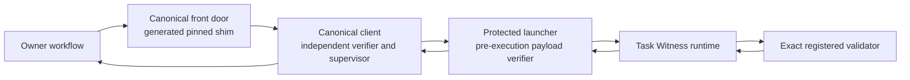
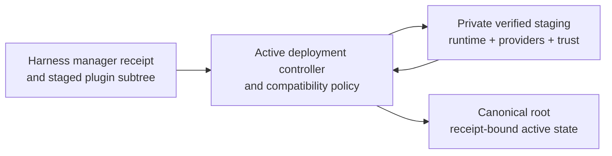

# Task Witness Canonical Client And Deployment Design

**Status:** Design approved; independent specification review clean; operator
review pending

**Date:** 2026-07-27

## Summary

Task Witness has one deployment-owned canonical front door:
`~/.local/libexec/task-witness/task-witness`.

Every workflow invokes that path. The generated shim starts a canonical Python
client, and the client starts the protected launcher under one fixed process
profile. Harness plugin caches and source checkouts may supply staged release
inputs, but they are never executable fallbacks and never participate in
runtime discovery.

The first release uses a stdlib-only Python client and protected Python
launcher. This is the lowest-maintenance macOS and Linux design that preserves
the existing exact-byte Python validator contract. The client/launcher
protocol remains language-neutral so a native client can replace the Python
client later without changing owner workflows.

The design deliberately provides a cooperative current-EUID integrity
boundary. It detects substitution, path drift, races, partial activation, and
result disagreement before accepting a result. It does not claim to resist an
actor that can arbitrarily replace the client, launcher, deployment state, and
consumer as the same EUID.

## Context

The protected launcher verifies the active record and exact runtime payload
bytes before it executes those payloads. The runtime then loads one exact,
registered validator from a retained trust context and validates one supplied
task-evidence bundle.

That is necessary but incomplete. A workflow also needs an independent client
to own:

- The exact launcher process it creates.
- The interpreter, arguments, environment, working directory, standard input,
  inherited descriptors, process session, and timeout.
- Independent expected-anchor construction.
- Strict envelope framing and schema acceptance.
- Exact whole-anchor equality.
- Bounded output and deterministic failure.

Deployment also needs one lifecycle for importing harness-managed plugin
updates, retaining their exact validator and trust artifacts, freezing their
identities, activating them, rolling them back, and keeping all harnesses on
one canonical runtime.

## Goals

- Give every owner workflow one stable, deployment-owned executable path.
- Preserve independent complete-anchor verification.
- Keep runtime execution independent of mutable harness caches and source
  checkouts.
- Retain exact trust contexts and validator modules beneath the canonical root.
- Make compatible marketplace updates low-friction without turning trust into
  mutable runtime discovery.
- Distinguish source trust, executable trust, and workflow authority.
- Make payload activation and control-component maintenance crash-safe and
  rollback-capable.
- Fail closed on drift, ambiguity, unsupported changes, and partial recovery.
- Support qualified macOS and Linux deployments without a native build
  toolchain.
- Preserve exact historical Python validators.

## Non-Goals

- Sandboxing registered validators.
- Proving authenticity against arbitrary same-EUID compromise.
- Granting workflow, publication, review, or merge authority.
- Discovering a runtime from `PATH`, `$HOME`, XDG variables, a harness cache,
  a caller argument, or a source checkout.
- Supporting multiple active roots, channels, or process profiles.
- Dynamically negotiating incompatible protocols.
- Supporting Windows in the first release.
- Rewriting the existing Python validator ABI.
- Shipping a daemon to avoid Python startup cost.

## Terms And Authority Domains

### Canonical root

The one current-EUID-owned installation at:

`pwd.getpwuid(os.geteuid()).pw_dir/.local/libexec/task-witness`

All supported harnesses for that OS account share it. `$HOME`, XDG variables,
the invoking harness, `sudo` real-user inference, and caller-supplied paths do
not affect root selection.

### Canonical front door

The executable file at:

`~/.local/libexec/task-witness/task-witness`

Consumers invoke only this path. There is no runtime-path flag and no fallback.

### Control set

The generated shim, canonical client, protected launcher, pinned interpreter
identity, process profile, deployment controller, compatibility-policy engine,
and deployment receipt parser. These components control what runs, what may be
activated, and what result can be accepted.

### Deployment controller

The deployment-owned activator and compatibility-policy engine installed
beneath the canonical root. It alone imports staged plugin inputs, validates
provider declarations, classifies candidate changes against the already-active
policy, constructs retained trust contexts, writes deployment receipts, and
performs activation or rollback.

The controller's exact source bytes, policy document, interpreter, and
installed disposition are receipt-bound control-set inputs. A candidate
controller never classifies or activates itself; the currently active
controller evaluates its replacement.

### Payload generation

One immutable, content-addressed set of Task Witness runtime modules beneath
`generations/sha256-<runtime-implementation-digest>/`.

### Provider declaration

One strict, content-addressed runtime manifest supplied by a plugin that
registers Task Witness producers, issuers, or validators. It declares the
plugin identity, authority profile, lifecycle, capabilities, contracts,
ordered validator modules, relative source paths, lengths, and SHA-256 values.

All module paths are traversal-free and relative to the exact staged plugin
root. The declaration does not contain installed absolute paths and cannot
authorize undeclared files.

### Retained trust store

The canonical root's immutable, content-addressed trust contexts and validator
module sets. Deployment copies verified provider modules into this store and
constructs a canonical `task-witness-trust-context-v2` whose absolute module
paths point only into the retained store.

New-publication validation uses the active context digest bound by the
deployment receipt. Historical validation may select one exact retained
context digest. No workflow supplies a production trust-context path.

### Harness source trust

The authorization already expressed when an operator installs, enables, or
updates a plugin through a harness-managed marketplace. Under the default
policy, this authorizes the plugin's manifest-declared executable components,
including declared Task Witness validator roles, under their disclosed
authority profile.

This is an intentional user-experience and trust-policy choice. It is not a
claim that every harness cryptographically authenticates its marketplace.
Deployment must still snapshot the exact manager receipt, source authority,
release identity, and staged subtree bytes before activation.

### Task Witness execution trust

The exact producer, validator, issuer, lifecycle, capability, and artifact
identities frozen in a Task Witness trust context. Runtime selection uses only
that exact retained context. It never infers trust from live harness state.

Compatible plugin updates may produce a new exact trust context without a
second approval when a previously accepted policy covers that update. Exact
bytes always change the receipt even when authority does not change.

### Workflow authority

The workflow-specific decision to proceed, publish, request review, mark
ready, merge, or otherwise mutate external state. Task Witness never grants
this authority. A successful witness is evidence consumed by a workflow, not
permission to act.

## Architecture



The owner supplies only:

- An absolute, traversal-free bundle path.
- The historical-mode bit.
- For historical mode only, the exact retained trust-context digest recorded
  by the original evidence receipt.

The owner cannot select the root, interpreter, client, launcher, process
profile, timeout, output limits, source mode, channel, release, or validator.
It cannot supply a trust-context or validator path.

The client:

1. Derives the canonical root from the effective user's OS-account home.
2. Acquires the deployment shared lock, except for the deployment-only
   acceptance path that validates and retains the controller's inherited
   exclusive lock.
3. Opens and strictly validates the active deployment receipt, active record,
   runtime payload identities, bundle, selected retained trust context, and
   every validator artifact named by that context.
4. Independently constructs the complete expected anchor.
5. Starts the protected launcher itself under the fixed process profile.
6. Reads stdout and stderr concurrently under fixed byte and time limits.
7. Accepts only a status-zero, empty-stderr, single canonical envelope.
8. Requires exact whole-anchor equality.
9. Rechecks the installation receipt and selected inputs before success.
10. Emits the accepted canonical envelope or one bounded diagnostic, never a
    partially accepted result.

The client does not import code from the launcher or runtime and does not share
their canonical parser implementation.

For new-publication validation, the client selects the active trust-context
digest from `deployment.json`. For historical validation, it resolves only the
caller-supplied exact digest beneath `trust/contexts/` and requires that digest
to be retained and authorized for historical use. In both cases, the client
passes the resulting canonical absolute context path to the launcher
internally.

Activation is a separate path:



The current controller and policy are deployment authority. Candidate
controller or policy bytes remain inert staged data until the current
controller classifies, transactionally installs, and verifies them.

## Canonical Installation Layout

```text
~/.local/libexec/task-witness/
├── task-witness
├── activation.lock
├── deployment.json
├── transaction.json
├── active.json
├── client/
│   └── task_witness_client.py
├── controller/
│   ├── task_witness_deploy.py
│   └── policy.json
├── launcher/
│   └── task_witness_launch.py
├── generations/
│   └── sha256-<runtime-implementation-digest>/
│       ├── task_witness.py
│       ├── canonical.py
│       ├── bundle_io.py
│       └── trust.py
├── trust/
│   ├── contexts/
│   │   └── sha256-<trust-context-byte-digest>.json
│   └── validators/
│       └── sha256-<validator-implementation-digest>/
│           └── <ordered-module-token>.py
├── smoke/
│   └── bundle/
└── receipts/
    └── sha256-<deployment-receipt-digest>.json
```

Required disposition:

- Every directory is a nonsymlink directory owned by the effective user with
  mode `0700`.
- The front door is a nonsymlink regular file owned by the effective user with
  mode `0500`.
- Installed Python source is a nonsymlink regular file owned by the effective
  user and inaccessible to group and other users.
- Mutable state and lock files are current-user private.
- `transaction.json` exists only while a prepared activation or recovery
  transaction is incomplete; its exact old and candidate receipt identities
  make recovery deterministic.
- Content-addressed generations are never modified in place.
- Retained trust contexts and validator module sets are immutable and are never
  read from their former cache or checkout paths after import.
- The smoke bundle, smoke validator, and smoke trust context are
  Task-Witness-owned, exact-byte-pinned, side-effect-free activation fixtures;
  they grant no owner workflow capability.
- Every selected path is descriptor-opened without following a final symlink
  and is reread or rechecked where the protocol requires it.

The deployment receipt binds exact paths, lengths, digests, owners, modes, and
contract identities. A successful envelope is not a deployment receipt.

## Source Selection

Exactly one deployment source-selection mode is active:

### `harness_snapshot`

This is the default. One harness adapter supplies:

- The named harness and manager.
- The exact manager authorization receipt.
- The source publisher, repository, and channel identity.
- The exact installed plugin subtree digest.
- The immutable public release identity.

The snapshot is resolved once during deployment. Runtime never reads a harness
cache or registry.

Another supported harness may propose a later candidate only when it presents
the same source authority and forward release lineage. A candidate that reuses
an immutable release identity with different bytes fails integrity validation.
A candidate older than the last activated forward release is a downgrade and
does not activate automatically.

### `publisher_channel`

Deployment follows one named publisher, repository, and channel. The mutable
channel mapping is resolved once to an immutable release revision and exact
subtree digest before staging. Channel state never participates in runtime
selection.

### `exact_release`

Deployment accepts only one repository identity, immutable revision, and exact
Task Witness subtree digest. A version string alone is not an exact pin.

Mode-specific fields are forbidden in the other modes. Changing the selection
mode, source authority, repository, channel, or pin is an authority boundary.
There is no union, newest-wins, last-writer-wins, or runtime preference order.

## Provider Declarations And Trust Materialization

A plugin registers Task Witness providers through one strict
`task-witness-provider.json` at its plugin root. Absence means that the plugin
registers no Task Witness producer, issuer, or validator.

The declaration contract is `task-witness-provider-declaration-v1` and contains
only:

- Schema version, contract, and content digest.
- Plugin ID, publisher, repository, and declared authority profile.
- Producer identities, contracts, validator bindings, and lifecycle.
- Issuer identities, contracts, capabilities, and lifecycle.
- Validator identities, contracts, entrypoint module, ordered module
  inventory, and lifecycle.
- For every module: closed module token, traversal-free plugin-relative path,
  byte length, and SHA-256.

The declared validator implementation identity is path-independent and is
computed from the validator contract, entrypoint token, and ordered module
tokens and digests. Absolute source paths, cache paths, and deployment paths
are forbidden.

The currently active deployment controller:

1. Verifies the harness/manager receipt and exact staged plugin subtree.
2. Strictly parses the provider declaration and both harness plugin manifests.
3. Constructs one composite source identity through field-specific
   cross-bindings:
   - Plugin ID agrees among the provider declaration, both harness manifests,
     and manager receipt.
   - Publisher and repository agree among the provider declaration, the
     corresponding manifest author/repository fields, and the resolved
     source-selection record.
   - Release version agrees between both harness manifests and the manager
     receipt.
   - Immutable revision, staged subtree digest, channel, manager trust class,
     and source authority agree between the manager receipt and resolved
     source-selection record.
   - The declaration's authority profile, provider roles, lifecycle, and
     capabilities are covered by the already-active compatibility policy.
   A document is compared only for fields its contract owns; the controller
   binds the resulting composite identity into the deployment receipt.
4. Opens the verified plugin root once, then traverses every relative module
   path descriptor-by-descriptor. Each intermediate component must be a real
   directory opened with no symlink following; the final component must be a
   nonsymlink regular file. Absolute paths, `..`, empty components, special
   files, and any symlink in the chain fail before import.
5. Verifies each module's length, digest, order, and implementation identity.
6. Copies the exact bytes into
   `trust/validators/sha256-<implementation-digest>/`.
7. Rereads and verifies every retained module.
8. Rewrites module paths to their canonical absolute retained locations.
9. Deterministically composes all authorized provider declarations plus the
   Task-Witness-owned smoke provider into one
   `task-witness-trust-context-v2`.
10. Writes that context as
   `trust/contexts/sha256-<SHA-256-of-exact-context-bytes>.json`.
11. Binds the active context digest, provider declarations, retained module
    identities, and authority profile into the deployment receipt.

Duplicate or conflicting provider identities fail closed. The controller does
not merge undeclared cache contents or infer sibling files. The retained trust
context's internal canonical content digest and exact-byte SHA-256 are
deployment-specific because its module paths are canonical absolute installed
paths; validator implementation identities remain path-independent and
portable.

Once retained, validation opens only canonical trust-store paths. Harness cache
refresh, deletion, source-checkout movement, or source-file replacement cannot
change or invalidate an active or retained historical context.

## Trust And Update Policy

### Default: inherit harness trust

Installing or enabling a plugin through a supported harness means accepting
that plugin's documented Task Witness mechanisms. Task Witness does not add a
duplicate generic confirmation before using what the harness already
authorized.

The deployer converts that authorization into immutable evidence:

- It snapshots one exact manager receipt and staged subtree.
- It validates source shape and public release identity.
- It records the exact control, runtime, interpreter, and trust-context bytes.
- It compares the candidate with the active receipt using trusted, already
  active policy code.
- It writes a new receipt before activation.

Candidate code never decides whether its own change is compatible.

### Compatible forward update

A forward update may activate without another prompt when the active policy
already authorizes all of the following:

- The same publisher, repository, channel, and manager trust class.
- A supported forward release lineage.
- The same declared validator-role inventory.
- The same validator authority profile.
- The same process profile.
- Supported client, launcher, runtime, envelope, anchor, canonicalization, and
  trust-context contracts.
- The same interpreter supplier and provenance class.
- The same CPython major/minor line.
- The same supported platform boundary.
- No downgrade, rollback, discovery expansion, or new dependency class.

Runtime, validator, client, shim, launcher, controller,
compatibility-policy, interpreter-microversion, and receipt bytes may change
within that policy. Their exact new identities are always verified and
recorded. Byte identity is evidence; it is not by itself an approval boundary
under channel-following policy. A policy-semantic change still changes future
update authority and is a genuine boundary even when the policy file arrives
from the same channel.

This policy accepts that a publisher already authorized to ship full-process
validator code can change that code within the previously disclosed ambient
authority. Task Witness cannot prove behavioral equivalence from metadata.
Operators or institutions that do not want that tradeoff use
`exact_release`.

### Genuine boundary change

A supported change must stop before candidate execution or active mutation and
use the harness's or deployer's native approval surface when it changes:

- Publisher, repository, marketplace, channel, signing identity,
  source-selection mode, or manager/source trust class. Switching between
  managers that present the same already-authorized source authority and trust
  class is not by itself a boundary.
- Canonical root or protection-authority class.
- Validator-role inventory, producer/issuer lifecycle, credential exposure,
  or declared authority profile.
- Interpreter supplier, provenance class, implementation, or major/minor line.
- Process environment, working directory, descriptor policy, timeout, output
  limits, or containment claim.
- Protocol, schema, canonicalization, complete-anchor, or compatibility range.
- Dependency class or previously undisclosed executable dependency.
- Supported platform boundary.
- Discovery, multi-root, multi-channel, or fallback behavior.
- Downgrade or explicit rollback target.
- Future update policy itself.

Approval binds one exact candidate transaction digest. Approving one
transaction and changing future update policy are separate choices.
Noninteractive operation returns a typed authority-change failure. It never
times out into approval and never reads approval from an environment variable.

### Non-approvable failure

The following fail closed without an override prompt:

- Digest, length, owner, mode, receipt, or immutable-release disagreement.
- Missing or malformed required evidence.
- Unknown fields or parser disagreement.
- Partial or mixed control-set state.
- Unsupported protocol, platform, interpreter, or dependency.
- Reused immutable identity with different bytes.
- Unavailable or unverifiable rollback material where rollback is required.
- Unexplained active-installation drift.
- Failure to prove that a candidate is covered by the active policy.

An operator must restore or deploy a new verifiable state. Approval cannot
convert broken evidence into valid evidence.

## Deployment Receipt

The canonical, strict JSON deployment receipt binds at least:

- Schema and contract versions.
- Deployment sequence.
- Prior receipt digest.
- Canonical root and effective UID.
- Platform OS, architecture, and qualified-filesystem class.
- Source-selection mode and exact resolved source identity.
- Harness/manager receipt identity when applicable.
- Public repository, immutable revision, release version, and subtree digest.
- Shim, client, launcher, controller, and policy paths, lengths, SHA-256 values,
  owners, and modes.
- Resolved CPython path, executable SHA-256, implementation, exact version,
  supplier, and provenance class.
- Exact process-profile contract and limits.
- Active-record path and digest.
- Runtime generation and implementation digest.
- Runtime, envelope, anchor, canonicalization, and trust-context contracts.
- Exact provider-declaration digests, active trust-context byte digest and
  canonical retained path, registered role inventory, retained validator
  module paths and identities, and authority profile.
- Active compatibility/update-policy digest.
- Retained rollback receipt and artifact identities.
- Receipt content digest.

The receipt contains no credentials, bundle contents, validator output, or
ambient environment values.

The canonical client never reconstructs a missing receipt from an envelope,
cache, source checkout, or current filesystem contents.

## Pinned Shim

The generated shim is a minimal POSIX script whose exact rendered bytes are
receipt-bound. It:

- Uses only absolute executable and script paths.
- Starts the canonical client through the deployment-pinned CPython.
- Uses exactly `-B -I -S`.
- Establishes the fixed client environment without inheriting caller
  variables.
- Forwards only the client arguments.
- Contains no source, channel, release, or root discovery.

It does not use `#!/usr/bin/env`, `PATH` lookup, a version-manager shim, or a
multi-argument Python shebang.

The client defensively verifies its canonical path, interpreter identity,
receipt, and process contract. It can verify the installed shim bytes but
cannot prove that a particular invocation traversed that shim; deployment
evidence owns that claim.

The public front-door request is exactly:

```text
task-witness validate --bundle <absolute-bundle>
task-witness validate --bundle <absolute-bundle> \
  --historical --trust-context-sha256 <retained-context-byte-digest>
```

`--historical` and `--trust-context-sha256` must appear together. New work
accepts neither option and always uses the active receipt-bound trust context.
There is no public `--trust-context` path option.

## Fixed Process Profile

Both the client entry and launcher child use the deployment-pinned absolute
CPython with exactly:

```text
-B -I -S
```

The launcher child receives exactly:

```text
LANG=C.UTF-8
LC_ALL=C.UTF-8
TZ=UTC
```

No caller variable is forwarded. In particular, the child receives no
inherited `HOME`, `PATH`, Python, virtual-environment, Git, SSH, XDG, proxy,
credential, or locale variables.

The client derives the OS-account home through the password database. The
fixed locale must pass deployment conformance; there is no silent locale
fallback.

The launcher child also receives:

- `cwd=/`.
- Closed standard input.
- Captured stdout and stderr.
- `close_fds=True` and no passed descriptors.
- A new process session.
- Restored default child signals.
- `umask 077`.
- No shell and no `preexec_fn`.

The child argument vector is exactly:

```text
[
  <pinned-absolute-cpython>,
  "-B",
  "-I",
  "-S",
  <canonical-absolute-launcher>,
  "validate",
  "--bundle",
  <absolute-bundle>,
  "--trust-context",
  <absolute-trust-context>,
  ["--historical"]
]
```

`--historical`, when present, appears exactly once and last. Unknown or
duplicate options, relative paths, traversal, and NUL-containing arguments
fail before spawn.

## Resource And Output Bounds

The first process-profile contract fixes:

- Validation deadline: 60 seconds from immediately before spawn through
  complete envelope receipt.
- Termination grace: 2 seconds after timeout or stream overflow.
- Forced kill, reap, and pipe-close budget: 1 second.
- Post-leader pipe-drain allowance: 1 second within the cleanup budget.
- Stdout maximum: 4 MiB.
- Stderr maximum: 256 KiB.
- Client diagnostic maximum: one ASCII line of 4 KiB.
- I/O read chunk: 64 KiB.
- Client shared-lock acquisition: 2 seconds.
- Activator exclusive-lock acquisition: 65 seconds.

The implementation reads stdout and stderr concurrently and counts raw bytes.
It does not use an unbounded convenience buffer.

On timeout or overflow, it sends `SIGTERM` to the child's process group, waits
at most two seconds, sends `SIGKILL`, reaps the direct child, closes pipes, and
returns failure. It never retries because a validator may already have
performed ambient side effects.

Process-group cleanup is a liveness mechanism, not a sandbox. A trusted
validator may create another session or otherwise escape ordinary descendant
cleanup.

## Envelope Acceptance

Success requires all of the following:

- The child exits with status exactly `0`.
- Child stderr is empty.
- Stdout stays within its byte limit.
- Stdout is strict UTF-8.
- Stdout contains exactly one canonical JSON object followed by exactly one
  line feed and then EOF.
- There are no duplicate keys, unknown fields, missing fields, non-finite
  numbers, excessive numeric tokens, excessive nesting, leading bytes,
  trailing whitespace, or a second document.
- The envelope contract is exact.
- The envelope and witness agree on bundle digest, trust-context digest, and
  historical mode.
- The returned anchor equals the independently constructed complete expected
  anchor as a whole object.
- Pre-launch and post-child installation, receipt, bundle, and trust-context
  checks agree.

The complete expected anchor contains:

- Runtime generation.
- Active-record SHA-256.
- Runtime contract.
- Exact interpreter identity.
- Public release identity.
- Runtime-implementation SHA-256.
- Trust-context SHA-256.
- Bundle SHA-256.
- Historical-mode bit.

The client emits the canonical envelope on stdout only after complete
acceptance. On failure, stdout is empty and stderr contains one bounded,
nonsecret diagnostic.

Deterministic exit classes:

- `64`: invalid client invocation.
- `65`: launcher failure, output framing, schema, canonicalization, or anchor
  disagreement.
- `70`: installation, receipt, input, or dependency drift.
- `124`: timeout or resource limit.

Arbitrary child stderr is never relayed as proof output.

## Activation State Machine

Deployment recognizes:

- `absent`: no active deployment.
- `staged`: candidate inputs exist outside active state.
- `verified`: exact candidate and rollback material passed preflight.
- `approval-required`: a supported genuine boundary change awaits operator
  approval through the harness or deployer.
- `active`: canonical root and receipt agree.
- `rollback-ready`: a prior complete activation unit is retained.
- `rejected`: candidate failed without changing active state.
- `recovery-required`: active integrity is invalid or complete rollback failed.

Plugin installation or cache refresh ends at `staged`. It is not activation
evidence.

### Deployment-only acceptance handoff

Canonical activation acceptance runs while the controller still holds the
exclusive deployment lock. It does not release the lock and race ordinary
workflows.

On macOS and Linux, `activation.lock` uses advisory BSD `flock` semantics
through Python's `fcntl.flock`:

- The controller opens the canonical nonsymlink regular lock file with
  `O_RDWR | O_CLOEXEC | O_NOFOLLOW`, verifies its current-user-private
  disposition, and acquires `LOCK_EX`.
- For the smoke child only, the controller duplicates that same open file
  description onto descriptor `3`, marks only descriptor `3` inheritable, and
  launches the shim with an explicit pass-descriptor set containing only `3`.
- The shim and its absolute environment-clearing executable preserve
  descriptor `3` across `exec` into the client. No other nonstandard descriptor
  is inherited.

The controller:

1. Writes `transaction.json` with phase `candidate-smoke`, the exact candidate
   receipt, retained smoke bundle, retained smoke trust-context digest, and
   expected lock-file identity.
2. Holds the exclusive `activation.lock` open through reserved descriptor `3`.
3. Starts the canonical front door with the private `activation-smoke` command
   and passes only that already-held descriptor at its reserved number.

The client accepts `activation-smoke` only when:

- Descriptor `3` is present.
- It identifies the canonical nonsymlink `activation.lock`.
- It carries the controller's already-held exclusive lock.
- `transaction.json` is canonical, current, and binds the exact candidate
  deployment receipt.
- The candidate receipt binds the exact Task-Witness-owned smoke bundle,
  context, validator, and expected projection.

The client proves that descriptor `3` carries the inherited lock without
silently acquiring an unlocked file:

1. `fstat(3)` must match the transaction-bound canonical lock identity.
2. A separately opened probe descriptor's nonblocking `LOCK_SH` attempt must
   fail with the platform's would-block result, proving an exclusive lock
   already exists before the client touches descriptor `3`.
3. A nonblocking `LOCK_EX` operation on descriptor `3` must succeed, proving
   the inherited open file description is the exclusive-lock owner rather than
   a different process's lock.
4. A second probe must still fail.
5. The client immediately restores close-on-exec on descriptor `3`, retains it
   through post-child verification, and excludes it from the launcher's
   descriptor set.

Any other result fails before launcher execution. The macOS and Linux
conformance suites must establish these exact `flock`, duplicate-descriptor,
shell-preservation, and close-on-exec behaviors.

The client then treats the inherited descriptor as its deployment lock,
retains it through post-child verification, and prevents it from reaching the
launcher child. It selects only the receipt-bound smoke bundle and context;
there is no caller path, environment variable, token string, or public option
that can select a different activation input.

An ordinary caller that spells `activation-smoke` without the inherited
descriptor and exact live transaction fails before launcher execution. The
descriptor alone is also insufficient without the transaction and candidate
receipt cross-bindings.

This is a maintenance capability, not a second validator process profile. The
launcher child still receives the one fixed process profile.

If candidate acceptance fails, the controller does not reuse the candidate
transaction for rollback validation. While retaining the same exclusive lock,
it:

1. Writes and durably synchronizes a new canonical `transaction.json` with
   phase `rollback-smoke`, the exact prior receipt, and that receipt's retained
   smoke inputs.
2. Restores the complete prior activation unit.
3. Invokes the same inherited-lock `activation-smoke` path.
4. Requires the client to prove that active state, smoke inputs, and expected
   anchor match the rollback target rather than the failed candidate.

Unknown phases, a phase/target disagreement, or reuse of candidate smoke
authority after restoration fails closed.

### Routine payload transaction

When the current control set supports the candidate contracts:

1. Import the candidate into a private deployment staging directory.
2. Verify source authority, release, inventory, payloads, interpreter,
   contracts, policy coverage, and rollback material.
3. Write each payload, set its disposition, reread it, and `fsync` it.
4. Rename the complete generation to its content-addressed name and `fsync`
   `generations/`.
5. Write and verify the prospective immutable receipt.
6. Write temporary active-state files on the destination filesystem.
7. Acquire the exclusive deployment lock.
8. Revalidate candidate, current state, and rollback material.
9. Replace active state using same-directory atomic renames and durable
   directory synchronization.
10. Run deployment-only canonical acceptance through the inherited-lock
    handoff before releasing the lock.
11. On failure, enter the durable `rollback-smoke` phase, restore the exact
    prior active unit, and rerun acceptance against the prior receipt.
12. Retain the failed candidate as inactive evidence and report the rollback
    result.

The design does not claim that replacing `active.json` and
`deployment.json` is one filesystem-atomic operation. The deployment journal,
receipt cross-bindings, and client preflight make every intermediate
combination either the complete old state, the complete new state, or an
explicit `recovery-required` fail-stop. Recovery completes or restores the
recorded transaction; it never treats a mismatched pair as active.

Concurrent clients hold the shared lock through post-child verification. They
observe the complete old state, the complete new state, or an explicit
fail-stop. They never accept mixed state.

### Control-set maintenance transaction

A shim, client, launcher, controller, compatibility policy, interpreter,
process profile, or control-receipt parser change uses a separate maintenance
transaction:

1. Stage and fully verify the complete replacement control set and a complete
   rollback preimage.
2. Classify trust and compatibility before mutation.
3. Acquire the exclusive lock and freeze new invocations.
4. Drain the bounded current invocation window.
5. Revalidate active state, replacement state, and rollback state.
6. Install the complete replacement set, reread every selected byte, and
   replace the canonical shim last.
7. Run deployment-only canonical acceptance through the inherited-lock
   handoff.
8. Unfreeze only after success.
9. On failure, restore the complete prior controller, policy, client, launcher,
   shim, interpreter disposition, process profile, and receipt parser, then
   verify that complete preimage.

A compatible control-byte update may be preauthorized by inherited
publisher/channel policy, but it still uses the maintenance transaction.
Transaction class and prompt policy are separate concerns.

Crash recovery may yield:

- Verified old state.
- Verified new state.
- An explicit fail-stop recovery state.

Mixed control bytes never count as active. Recovery never fabricates a receipt
or successively guesses older states.

## Rollback

Activation preauthorizes automatic rollback to the exact retained prior
receipt. Automatic rollback does not prompt again.

The deployer:

1. Stops using the failed candidate.
2. Verifies every retained target artifact and receipt.
3. Restores the complete prior activation unit.
4. Runs canonical acceptance through the front door.
5. Records the failed candidate and rollback result.

An explicit manual rollback names one exact retained target. Generic
"previous" UI must display the exact current and target identities before
mutation. A downgrade or rollback outside already preauthorized automatic
recovery is a genuine boundary change.

If the target is missing, damaged, unsupported, or unverifiable, rollback does
not run. If rollback acceptance fails, the system enters `recovery-required`
and does not automatically try successively older states.

## Operator Diagnostics

Every diagnostic states:

- What changed or failed.
- Whether any validator code executed: `yes`, `no`, or `unknown`.
- Whether active state changed: `yes`, `no`, or `unknown`.
- Current and candidate abbreviated receipt identities.
- Whether rollback ran and whether it succeeded.
- One safe next action.

The client reports `unknown` whenever timeout, ambiguous process termination,
crash recovery, or incomplete durable-state evidence prevents it from
establishing the answer. It never infers nonexecution from missing output.

Required classes include:

- Staged candidate and no-op refresh.
- Operator approval required through the harness or deployer for an authority
  or compatibility change.
- Source unavailable.
- Invalid manifest or source shape.
- Integrity or active-state drift.
- Unsafe filesystem disposition.
- Missing or replaced interpreter/dependency.
- Unsupported protocol/platform.
- Lock contention.
- Candidate rejected and rolled back.
- Invalid rollback target.
- Rollback failure requiring recovery.
- Missing or replaced canonical front door.

Diagnostics do not expose credentials, bundle contents, trust-context
contents, arbitrary validator output, or ambient environment values.

## Portability

The first qualified full-suite targets are:

- macOS arm64 with the deployment-pinned CPython microversion.
- Linux x86_64 with the deployment-pinned CPython microversion.

The same complete process, envelope, drift, activation, crash-cut, and rollback
suite runs on both targets. A Python microversion is a deployment profile, not
an open compatibility range.

Before advertising support, other common macOS/Linux architectures receive at
least:

- Install and receipt verification.
- Shim and client execution.
- One valid validation.
- One timeout and process-group cleanup test.
- One activation and rollback smoke test.

Network filesystems and filesystems that do not supply the required local
locking, atomic same-directory rename, and directory synchronization semantics
are unsupported until separately qualified. Missing `pwd`, descriptor flags,
ownership/mode semantics, process sessions, or required locale behavior fails
before validator execution.

Windows is deferred because the current launcher and process contract depend
on POSIX user, descriptor, permission, signal, and filesystem semantics.

## Verification And Acceptance

Implementation cannot freeze until it passes:

### Client contract

- Exact arguments, environment, cwd, stdin, descriptor set, session, signals,
  umask, timeout, and output bounds.
- New work selecting only the active receipt-bound trust context.
- Historical work selecting only one exact retained context byte digest.
- Arbitrary trust-context and validator paths rejecting before spawn.
- Hostile caller `HOME`, `PATH`, Python, virtual-environment, Git, SSH, XDG,
  proxy, locale, warning, and implementation-option inputs.
- Leading/trailing bytes, extra JSON, duplicate keys, unknown fields,
  malformed UTF-8, excessive depth, oversized numbers, oversized streams,
  premature EOF, nonzero exit, and timeout.
- Exact whole-anchor mismatch for every anchor field.
- Bundle, trust-context, active-record, generation, client, launcher, shim, and
  receipt mutation before and after child execution.
- No retry after timeout, malformed output, mismatch, or ambiguous termination.

### Launcher and runtime boundary

- Entrypoint restore after substitution.
- Sibling payload swap.
- Special-file and symlink replacement.
- Post-snapshot mutation.
- Active-record swap.
- Direct payload invocation or import.
- Environment injection.
- Rotation crash and incomplete generation.
- Retained-descriptor reread disagreement.

### Trust and update policy

- First activation through a harness-managed install without a duplicate
  generic prompt.
- Strict provider-declaration parsing and exact subtree binding.
- Field-specific composite binding across provider declaration, both harness
  manifests, manager receipt, source-selection record, and approved authority
  profile, including rejection when any shared field disagrees.
- Declared validator modules copied, reread, and rewritten only to canonical
  retained paths.
- Cache and checkout deletion or movement after activation having no effect on
  active or historical validation.
- Undeclared files, absolute source paths, traversal, final or intermediate
  symlinks, special components, duplicate identities, and manifest/module
  disagreement failing closed.
- Candidate controller or policy bytes remaining inert until classified by the
  active controller and policy.
- Compatible controller/policy bytes using the complete maintenance
  transaction and policy-semantic changes requiring operator approval.
- Compatible same-authority forward update without a prompt and with a new
  exact receipt.
- Existing validator-role byte update within the accepted authority profile.
- New validator role or authority profile requiring operator approval through
  the harness or deployer.
- Publisher, repository, channel, selection-mode, or manager/source trust-class
  change requiring operator approval through the harness or deployer.
- Equivalent source-authority evidence presented through another already
  authorized manager not prompting merely because the manager name changed.
- CPython micro update within the same supplier/provenance/major-minor policy.
- CPython supplier, provenance, implementation, or major/minor change requiring
  operator approval through the harness or deployer.
- Same immutable release identity with different bytes failing integrity.
- Downgrade and rollback classification.
- Harness cache update or deletion after activation having no runtime effect.
- Candidate code unable to classify its own update.
- Missing or ambiguous evidence failing closed.

### Activation and recovery

- Deployment-only acceptance inheriting the exact exclusive lock on descriptor
  `3` without reacquiring a shared lock.
- macOS and Linux `flock` probes proving preexisting exclusivity, inherited
  open-file-description ownership, shell preservation, and close-on-exec
  restoration.
- `activation-smoke` rejecting without the exact inherited descriptor,
  transaction, candidate receipt, smoke bundle, and smoke context.
- Candidate and rollback smoke phases each accepting only their exact target
  receipt and retained smoke inputs.
- No deployment lock descriptor reaching the launcher or validator process.
- Interruption after every durable write, rename, receipt update, selector
  change, and synchronization point.
- Concurrent validations during staging and activation.
- Old success, new success, or explicit fail-stop at every crash cut.
- No accepted mixed control set.
- Failed acceptance restoring one exact prior unit.
- Damaged rollback material preventing rollback without reconstruction.
- Control-set freeze, drain, replacement, smoke, and complete-preimage restore.

### Platform conformance

- Full macOS arm64 and Linux x86_64 suites.
- Required release smoke for every additionally advertised architecture.
- Unsupported descriptor, locale, permission, filesystem, or session behavior
  failing before validator execution.

## Security And Evidence Claims

Given independently verified control-set and deployment-receipt identities
plus canonical-client execution, a client-accepted launch envelope binds only
the exact values stated by its anchor and witness:

- Runtime generation and active record.
- Runtime contract and implementation.
- Interpreter identity.
- Public release identity.
- Retained trust-context bytes.
- Retained bundle bytes.
- Historical mode.
- Selected validator projection.

The envelope by itself does not prove:

- That a particular invocation traversed the shim.
- Client or shim authenticity.
- Harness or manager provenance.
- Marketplace or channel history.
- Prompt approval.
- Deployment-receipt authenticity.
- Workflow authority.
- Sandboxing or complete descendant termination.
- Resistance to arbitrary same-EUID compromise.

Those observations belong to deployment policy and external receipts.

Registered validators remain exact-byte-pinned, full-process trusted Python
code with the invoking account's ambient filesystem, network, subprocess,
signal, thread, and process-exit authority. Task Witness is not a Python
sandbox.

## Native Migration

The first release does not add a native build or artifact supply chain.

Reconsider a small, stdlib-only native canonical client when at least one of
these becomes true:

- Task Witness is distributed independently to multiple operators.
- A root-owned, signed, or otherwise stronger protection boundary is required.
- Python-client startup, diagnostics, or operational failures are measured and
  materially harmful.
- Independent implementation diversity justifies a multi-platform binary
  release, provenance, signing, and rollback system.

A native client would replace only the client/supervisor. The protected Python
launcher, runtime, historical validators, complete-anchor contract, and
deployment lifecycle remain.

A fully native validation host is not an incremental migration. It would
require embedding CPython, rewriting every validator, or defining another
executable validator ABI, while still retaining a separate independent
acceptance boundary. That work requires a new design.

## Consequences

### Benefits

- One stable invocation contract across Codex, Claude, and future harnesses.
- Marketplace-friendly updates without dynamic runtime trust.
- Exact, independently accepted task evidence.
- Low first-release maintenance and no native release matrix.
- Honest, bounded protection claims.
- Explicit rollback and recovery semantics.

### Costs

- Two short-lived CPython processes per validation.
- A deployment adapter for each harness source.
- A private receipt and activation lifecycle outside plugin caches.
- Full-process trust in registered validators.
- Separate maintenance transactions for control-set changes.
- Required macOS and Linux conformance infrastructure.

These costs are accepted for the first release.
