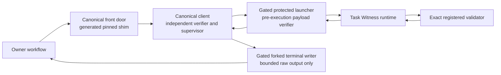
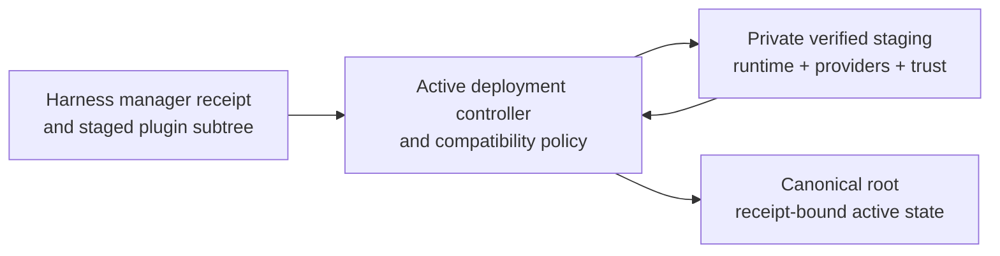

# Task Witness Canonical Client And Deployment Design

**Status:** Approved implementation contract; independent specification review
clean; operator approved 2026-07-27

**Date:** 2026-07-27

## Summary

Task Witness has one deployment-owned canonical front door:
`~/.local/libexec/task-witness/task-witness`.

Every workflow invokes that path. The generated shim starts a canonical Python
client, and the client starts the protected launcher under one fixed process
profile. Harness plugin caches and source checkouts may supply staged release
inputs, but they are never executable fallbacks and never participate in
runtime discovery.

The first release uses a stdlib-only Python client and protected Python
launcher. This is the lowest-maintenance macOS and Linux design that preserves
the existing exact-byte Python validator contract. The client/launcher
protocol remains language-neutral so a native client can replace the Python
client later without changing owner workflows.

The design deliberately provides a cooperative current-EUID integrity
boundary. It detects substitution, path drift, races, partial activation, and
result disagreement before accepting a result. It does not claim to resist an
actor that can arbitrarily replace the client, launcher, deployment state, and
consumer as the same EUID.

## Context

The protected launcher verifies the active record and exact runtime payload
bytes before it executes those payloads. The runtime then loads one exact,
registered validator from a retained trust context and validates one supplied
task-evidence bundle.

That is necessary but incomplete. A workflow also needs an independent client
to own:

- The exact launcher process it creates.
- The interpreter, arguments, environment, working directory, standard input,
  inherited descriptors, process session, and timeout.
- Independent expected-anchor construction.
- Strict envelope framing and schema acceptance.
- Exact whole-anchor equality.
- Bounded output and deterministic failure.

Deployment also needs one lifecycle for importing harness-managed plugin
updates, retaining their exact validator and trust artifacts, freezing their
identities, activating them, rolling them back, and keeping all harnesses on
one canonical runtime.

## Goals

- Give every owner workflow one stable, deployment-owned executable path.
- Preserve independent complete-anchor verification.
- Keep runtime execution independent of mutable harness caches and source
  checkouts.
- Retain exact trust contexts and validator modules beneath the canonical root.
- Make compatible marketplace updates low-friction without turning trust into
  mutable runtime discovery.
- Distinguish source trust, executable trust, and workflow authority.
- Make payload activation and control-component maintenance crash-safe and
  rollback-capable.
- Fail closed on drift, ambiguity, unsupported changes, and partial recovery.
- Support qualified macOS and Linux deployments without a native build
  toolchain.
- Preserve exact historical Python validators.

## Non-Goals

- Sandboxing registered validators.
- Proving authenticity against arbitrary same-EUID compromise.
- Granting workflow, publication, review, or merge authority.
- Discovering a runtime from `PATH`, `$HOME`, XDG variables, a harness cache,
  a caller argument, or a source checkout.
- Supporting multiple active roots, channels, or process profiles.
- Dynamically negotiating incompatible protocols.
- Supporting Windows in the first release.
- Rewriting the existing Python validator ABI.
- Shipping a daemon to avoid Python startup cost.

## Terms And Authority Domains

### Canonical root

The one current-EUID-owned installation at:

`pwd.getpwuid(os.geteuid()).pw_dir/.local/libexec/task-witness`

All supported harnesses for that OS account share it. `$HOME`, XDG variables,
the invoking harness, `sudo` real-user inference, and caller-supplied paths do
not affect root selection.

### Canonical front door

The executable file at:

`~/.local/libexec/task-witness/task-witness`

Consumers invoke only this path. There is no runtime-path flag and no fallback.

### Control set

The generated shim, canonical client, protected launcher, post-startup
main-executable drift identity, process profile, deployment controller,
compatibility-policy engine, and deployment receipt parser. The externally
qualified CPython 3.13+ runtime closure is a deployment TCB input. Together,
these components control what runs, what may be activated, and what result can
be accepted.

### Deployment controller

The deployment-owned activator and compatibility-policy engine installed
beneath the canonical root. It alone imports staged plugin inputs, validates
provider declarations, classifies candidate changes against the already-active
policy, constructs retained trust contexts, writes deployment receipts, and
performs activation or rollback.

The controller's exact source bytes, policy document, post-startup
main-executable identity, and installed disposition are receipt-bound
control-set inputs. CPython closure supplier, provenance, and qualification
disposition are deployment evidence, not client-authenticated code identity. A
candidate controller never classifies or activates itself; the currently active
controller evaluates its replacement.

### Payload generation

One immutable, content-addressed set of Task Witness runtime modules beneath
`generations/sha256-<runtime-implementation-digest>/`.

### Provider declaration

One strict, content-addressed runtime manifest supplied by a plugin that
registers Task Witness producers, issuers, or validators. It declares the
plugin identity, authority profile, lifecycle, capabilities, contracts,
ordered validator modules, relative source paths, lengths, and SHA-256 values.

All module paths are traversal-free and relative to the exact staged plugin
root. The declaration does not contain installed absolute paths and cannot
authorize undeclared files.

### Retained trust store

The canonical root's immutable, content-addressed trust contexts and validator
module sets. Deployment copies verified provider modules into this store and
constructs a canonical `task-witness-trust-context-v2` whose absolute module
paths point only into the retained store.

New-publication validation uses the active context digest bound by the
deployment receipt. Historical validation may select one exact retained
context digest. No workflow supplies a production trust-context path.

### Harness source trust

The authorization already expressed when an operator installs, enables, or
updates a plugin through a harness-managed marketplace. Under the default
policy, this authorizes the plugin's manifest-declared executable components,
including declared Task Witness validator roles, under their disclosed
authority profile.

This is an intentional user-experience and trust-policy choice. It is not a
claim that every harness cryptographically authenticates its marketplace.
Deployment must still snapshot the exact manager receipt, source authority,
release identity, and staged subtree bytes before activation.

### Task Witness execution trust

The exact producer, validator, issuer, lifecycle, capability, and artifact
identities frozen in a Task Witness trust context. Runtime selection uses only
that exact retained context. It never infers trust from live harness state.

Compatible plugin updates may produce a new exact trust context without a
second approval when a previously accepted policy covers that update. Exact
bytes always change the receipt even when authority does not change.

### Workflow authority

The workflow-specific decision to proceed, publish, request review, mark
ready, merge, or otherwise mutate external state. Task Witness never grants
this authority. A successful witness is evidence consumed by a workflow, not
permission to act.

## Architecture



The owner supplies only:

- An absolute, traversal-free bundle path whose final directory and direct
  regular-file children are current-user-owned and inaccessible to group and
  other users. In other words, the supplied bundle directory and every direct
  child are current-EUID-owned and inaccessible to group and other users.
- At most 256 direct files, each at most 1 MiB and totaling at most 16 MiB.
  Both the client and retained runtime enumerate from the held directory
  descriptor and stop on the 257th entry before sorting or opening children.
- The historical-mode bit.
- For historical mode only, the exact retained trust-context digest recorded
  by the original evidence receipt.

The owner cannot select the root, interpreter, client, launcher, process
profile, timeout, output limits, source mode, channel, release, or validator.
It cannot supply a trust-context or validator path.

The client:

1. Verifies the canonical process profile, including the absence of any direct
   child and of trace, profile, or CPython monitoring instrumentation affecting
   the retained client-code closure, including the captured executing module
   frame, before deriving the canonical root from the effective user's
   OS-account home. This inspection does not mutate instrumentation state, and
   rejection may omit a diagnostic.
2. Acquires the deployment shared lock, except for the deployment-only
   acceptance path that validates and retains the controller's inherited
   exclusive lock.
3. Opens and strictly validates the active deployment receipt, active record,
   runtime payload identities, bundle, selected retained trust context, and
   every validator artifact named by that context.
4. Independently constructs the complete expected anchor.
5. Rechecks that it has no existing direct child, creates a private
   close-on-exec gate, starts the protected launcher itself under the fixed
   process profile, stores the returned PID, restores the parent signal mask,
   checks cancellation, and only then releases the child to `exec`.
6. Reads stdout and stderr concurrently under fixed byte and time limits.
7. Accepts only a status-zero, empty-stderr, single canonical envelope.
8. Requires exact whole-anchor equality.
9. Rechecks the installation receipt and selected inputs before success.
10. After complete internal acceptance, repeats the no-existing-direct-child
    check and forks a terminal writer behind another private gate. The writer
    cannot write until the parent stores its PID, restores the parent signal
    mask, checks cancellation, and releases it. Parent success requires that
    writer's status-zero completion and reap followed by the final
    cancellation snapshot.
11. After invocation state exists, may attempt at most one bounded diagnostic
    through a separately gated and supervised writer on failure. Allocation
    failure before state and cancellation handlers exist exits `124` silently.
    The parent never writes terminal output directly, and no visible prefix is
    an accepted result.

If launcher or writer PID publication raises before lifecycle ownership is
established, including after a partial PID store, the parent records that first
error, revokes numeric signal authority, restores its signal mask, closes the
gate without releasing it, and boundedly wildcard-reaps the sole direct child.

The client does not import code from the launcher or runtime and does not share
their canonical parser implementation.

For new-publication validation, the client selects the active trust-context
digest from `deployment.json`. For historical validation, it resolves only the
caller-supplied exact digest beneath `trust/contexts/` and requires that digest
to be retained and authorized for historical use. In both cases, the client
passes the resulting canonical absolute context path to the launcher
internally.

The active deployment receipt binds a sorted `historical_trust_contexts`
registry. Each entry contains exactly `path`, `sha256`, and `state`, where
`state` is `historical-usable` or `revoked`. A compatible update carries the
registry forward; revocation writes a new receipt with the affected entry set
to `revoked`. The active context remains eligible for historical validation
through its active receipt binding and its entries' lifecycle states. A former
context is eligible only when its exact registry entry is
`historical-usable`. Content-addressed store presence and a context's
self-declared lifecycle do not confer deployment authority.

Activation is a separate path:



The current controller and policy are deployment authority. Candidate
controller or policy bytes remain inert staged data until the current
controller classifies, transactionally installs, and verifies them.

## Canonical Installation Layout

```text
~/.local/libexec/task-witness/
├── task-witness
├── activation.lock
├── deployment.json
├── transaction.json
├── active.json
├── client/
│   └── task_witness_client.py
├── controller/
│   ├── task_witness_deploy.py
│   └── policy.json
├── launcher/
│   └── task_witness_launch.py
├── generations/
│   └── sha256-<runtime-implementation-digest>/
│       ├── task_witness.py
│       ├── canonical.py
│       ├── bundle_io.py
│       └── trust.py
├── trust/
│   ├── contexts/
│   │   └── sha256-<trust-context-byte-digest>.json
│   └── validators/
│       └── sha256-<validator-implementation-digest>/
│           └── <ordered-module-token>.py
├── smoke/
│   └── bundle/
└── receipts/
    └── sha256-<deployment-receipt-digest>.json
```

Required disposition:

- Every directory is a nonsymlink directory owned by the effective user with
  mode `0700`.
- The front door is a nonsymlink regular file owned by the effective user with
  mode `0500`.
- Installed Python source is a nonsymlink regular file owned by the effective
  user, inaccessible to group and other users, and has link count one.
- Mutable state and lock files are current-user private and have link count
  one.
- Caller-supplied bundle state is separate from the installation tree: its
  final directory and each direct regular-file child are current-user-owned
  and have no group or other permissions; each child has link count one.
  Link-count-one enforcement rejects ordinary hard-link aliases; it does not
  detect bind-mount aliases. Deployment qualification must ensure caller
  bundles contain no mount alias to canonical installation state. Shared
  ancestors need not be private.
- `transaction.json` exists only while a prepared activation or recovery
  transaction is incomplete; its exact old and candidate receipt identities
  make recovery deterministic.
- Content-addressed generations are never modified in place.
- Retained trust contexts and validator module sets are immutable and are never
  read from their former cache or checkout paths after import.
- The smoke bundle, smoke validator, and smoke trust context are
  Task-Witness-owned, exact-byte-pinned, side-effect-free activation fixtures;
  they grant no owner workflow capability.
- Every selected path is descriptor-opened without following a final symlink
  and is reread or rechecked where the protocol requires it. Selected files
  and their immediate execution-private parent directories retain nanosecond
  modification/change tokens so a detected in-place or rename/restore ABA
  fails acceptance. Shared root and home ancestors retain stable mapping
  identity without noisy change tokens.

The deployment receipt binds exact paths, lengths, digests, owners, modes, and
contract identities. A successful envelope is not a deployment receipt.

## Source Selection

Exactly one deployment source-selection mode is active:

### `harness_snapshot`

This is the default. One harness adapter supplies:

- The named harness and manager.
- The exact manager authorization receipt.
- The source publisher, repository, and channel identity.
- The exact installed plugin subtree digest.
- The immutable public release identity.

The snapshot is resolved once during deployment. Runtime never reads a harness
cache or registry.

Another supported harness may propose a later candidate only when it presents
the same source authority and forward release lineage. A candidate that reuses
an immutable release identity with different bytes fails integrity validation.
A candidate older than the last activated forward release is a downgrade and
does not activate automatically.

### `publisher_channel`

Deployment follows one named publisher, repository, and channel. The mutable
channel mapping is resolved once to an immutable release revision and exact
subtree digest before staging. Channel state never participates in runtime
selection.

### `exact_release`

Deployment accepts only one repository identity, immutable revision, and exact
Task Witness subtree digest. A version string alone is not an exact pin.

Mode-specific fields are forbidden in the other modes. Changing the selection
mode, source authority, repository, channel, or pin is an authority boundary.
There is no union, newest-wins, last-writer-wins, or runtime preference order.

## Public Release Registration

`release/public-release-runtime-packages.json` is the generic, strict catalog
of runtime-package names. It convention-derives one required registration at
`release/<name>/public-release-registration.json` for each entry and rejects
both missing and unexpected registrations before deriving any projection. The
Task-Witness-owned registration contains schema version `1`, production
eligibility, source-stage flags, and sorted support paths. The catalog entry and
its package directory derive the name, runtime-package kind, and
`scripts/validate_<package-name-with-hyphens-replaced-by-underscores>.py`
validator path. Shared release code retains those derived values in its
normalized in-memory projection but gives the registration no second copy to
drift. The shared release validator independently requires Task Witness in the
source-stage catalog, so removing the catalog entry and registration together
still fails before package validation. This fixed requirement does not grant
production eligibility and does not defend against changes to the shared
validator itself. The accepted registration and marketplace projections are
deeply immutable; fixture loaders remain mutable until their results are
validated and projected. The effective source-stage support closure
automatically includes the catalog, registration, and derived validator.

The TW4 qualification-candidate registration starts source-stage-only and
production-ineligible. Source-stage validation discovers Task Witness, runs its
validator, and binds its exact package and support identity. While ineligible,
Task Witness is omitted from the
production-scoped plugin, validator, test, marketplace, plugin-eval,
expected-identity, receipt plugin-identity, and scoped release-contract and
release-scope inventories. Generic registration validation still binds it, and
the whole-repository Git candidate identity and release-receipt `candidate`
field still bind its committed bytes. Passing the package validator does not
change that declaration. After every TW4 qualification and release-evidence
gate closes, final promotion changes only `production_eligible` and the exact
marketplace route.

The Task Witness package validator exacts the declaration and measures its
bytes as a release-owned source-shape set. Shared release tests exercise only
generic discovery and validation; Task-Witness-specific inventory assertions
remain in the measured Task Witness package suite. A missing, displaced,
malformed, symlinked, or unmeasured registration fails source-stage release
validation.

The authoritative measured Task Witness test closure consists only of the
exact flat `tests/plugins/task_witness_client/` and
`tests/plugins/task_witness_deployment/` inventories plus
`tests/test_task_witness_package.py`. Those paths must remain regular,
nonsymlink, single-link files with the reviewed bytes recorded by the
source-shape measurement. Unrelated test trees are outside Task Witness
ownership and may contain byte-identical files without affecting validation.

## Prepared Release Supervision

Run the prepared-release wrapper only through the documented clean outer
environment. The proof claim begins at the wrapper's second clean-environment
CPython `-I -B` startup. It cannot retroactively neutralize a loader or
`sitecustomize` that ran before that startup; the qualified runtime and site
packages remain trusted for this gate. Both wrapper modes deliberately require
CPython 3.13 or newer.

The shell front door transfers lifecycle ownership to the internal
prepared-release supervisor, which starts the selected validator in a separate
session. Cancellation ownership begins after completed signal setup. At that
point, the supervisor has blocked `SIGINT`, `SIGTERM`, and `SIGHUP` and
accepted and normalized their inherited dispositions. Ownership ends at the
final empty pending-signal snapshot after `waitid(..., WNOWAIT)` observes the
retained leader terminal. A cancellation observed within that interval is
forwarded to the validation group. Signals arriving after the final snapshot
retain their inherited disposition and mask.

Only the 250 ms escalation grace is bounded. After that grace, the supervisor
sends `SIGKILL`; its exact leader reap is intentionally unbounded so it never
returns while it still owns a live leader. Cleanup of the private runtime is
always attempted. A cleanup failure exits with status `2` and may leave
residue. Group termination covers only same-EUID, signalable descendants that
remain in the original process group. Descendants that escape the group or
session, or change credentials, may survive. Ordinary success proves no
descendant quiescence.

Only an exact wrapper exit status of `0` authorizes accepting any receipt or
other generated output from this invocation. Cancellation can occur after
output bytes are written, so retained output from any nonzero invocation
remains unaccepted.

## Provider Declarations And Trust Materialization

A plugin registers Task Witness providers through one strict
`task-witness-provider.json` at its plugin root. Absence means that the plugin
registers no Task Witness producer, issuer, or validator.

The declaration contract is `task-witness-provider-declaration-v1` and contains
exactly `schema_version`, `contract`, `content_sha256`, `plugin_id`,
`publisher`, `repository`, `authority_profile`, `producers`, `issuers`, and
`validators`. Its exact file bytes are canonical JSON followed by one LF.
`content_sha256` is the lowercase SHA-256 of the canonical object with that
field omitted and without the trailing LF.

Each producer contains exactly `producer_id`, `contract`,
`implementation_sha256`, `validator_id`, `validator_contract`,
`validator_implementation_sha256`, and `lifecycle`. Each issuer contains
exactly `issuer_id`, `contract`, `implementation_sha256`, sorted nonempty
`capabilities`, and `lifecycle`. Each validator contains exactly
`validator_id`, `contract`, `implementation_sha256`, `entrypoint`, ordered
`modules`, and `lifecycle`. Each module contains exactly `name`,
`relative_path`, `length`, and `sha256`. A declaration lifecycle contains
exactly `state: active` and `usable_for_new_publication: true`; historical and
revocation state is deployment-owned retained-context state, not provider input.

IDs, authority profiles, capabilities, entrypoints, and module names are closed
lowercase tokens. Producer, issuer, and validator inventories are sorted by
ID, contract, and implementation digest. Module order remains declaration
order because it participates in validator identity. Module names and relative
paths are unique within a validator. A declaration must register at least one
role, but any individual category may be empty.

The declared validator implementation identity is path-independent and is
computed from the validator contract, entrypoint token, and ordered module
tokens and digests. Absolute source paths, cache paths, and deployment paths
are forbidden.

The currently active deployment controller:

1. Verifies the harness/manager receipt and exact staged plugin subtree.
2. Strictly parses the provider declaration, the root Agent Plugins v1
   manifest, and its exact Claude adapter projection. A current candidate must
   not contain a legacy `.codex-plugin` manifest.
3. Constructs one composite source identity through field-specific
   cross-bindings:
   - Plugin ID agrees among the provider declaration, Agent Plugins manifest,
     Claude projection, and manager receipt.
   - Publisher and repository agree among the provider declaration, the
     corresponding manifest author/repository fields, and the resolved
     source-selection record.
   - Release version agrees between the Agent Plugins manifest, Claude
     projection, and manager receipt.
   - Immutable revision, staged subtree digest, channel, manager trust class,
     and source authority agree between the manager receipt and resolved
     source-selection record.
   - The declaration's authority profile, provider roles, lifecycle, and
     capabilities are covered by the already-active compatibility policy.
   A document is compared only for fields its contract owns; the controller
   binds the resulting composite identity into the deployment receipt.
4. Opens the verified plugin root once, then traverses every relative module
   path descriptor-by-descriptor. Each intermediate component must be a real
   directory opened with no symlink following; the final component must be a
   nonsymlink regular file. Absolute paths, `..`, empty components, special
   files, and any symlink in the chain fail before import.
5. Verifies each module's length, digest, order, and implementation identity.
6. Copies the exact bytes into
   `trust/validators/sha256-<implementation-digest>/`.
7. Rereads and verifies every retained module.
8. Rewrites module paths to their canonical absolute retained locations.
9. Materializes and rereads the controller-owned Task Witness smoke provider
   into its own retained validator generation during staging.
10. Verifies every selected external and intrinsic retained generation, then
   deterministically derives one
   `task-witness-trust-context-v2`.
11. Publishes that exact context through an explicit staging mutation as
   `trust/contexts/sha256-<SHA-256-of-exact-context-bytes>.json`.
12. Rereads the published context; later composition checks open both retained
    generations and the context with creation disabled.
13. Binds the active context digest, provider declarations, retained module
    identities, and authority profile into the deployment receipt.

The intrinsic smoke provider is not represented by a plugin declaration and is
not user-selectable. A plugin cannot nominate, replace, or collide with its
producer, issuer, validator, or plugin identity. External providers are sorted
by plugin ID and declaration identities; composed roles are sorted by ID,
contract, and implementation digest. A producer's exact validator triple must
exist in the composed validator inventory.

The canonical client does not accept the receipt as self-authentication for
that intrinsic provider. From the exact retained smoke module bytes it
independently recomputes the fixed validator implementation, producer
implementation, issuer implementation, intrinsic declaration content digest,
and canonical declaration-byte digest. The fixed validator entrypoint and sole
module name are both `task-witness-smoke-validator`. A receipt and trust context
that coherently substitute any alternate intrinsic identity fail before the
launcher runs.

External receipt providers are validated independently of the deployment's
Task Witness control-source identity. Each selected external provider must
carry its exact full producer, issuer, and validator objects in the deployment
receipt and match exactly one active-policy entry by plugin ID and authority
profile. Those receipt-owned objects must equal the active trust objects
selected by that policy entry. The selected role claims form a disjoint, exact
partition of every non-smoke producer, issuer, and validator authority. Each
producer must select a validator owned by the same provider, and the provider's
receipt module inventory must equal the retained modules of only its claimed
validators. Additional policy entries remain an inactive allowlist; they do
not become selected merely by being present. In the current v1 control source,
`task-witness` is already the intrinsic provider identity, so source
provider-declaration digests are null and any non-null dangling pair fails
closed. External declaration and publisher identities remain receipt-owned;
only the intrinsic declaration has the independent byte derivation above.

Duplicate or conflicting provider identities fail closed. The controller does
not merge undeclared cache contents or infer sibling files. An existing
content-addressed validator generation or context is accepted idempotently only
after its complete inventory, private disposition, and exact bytes match; a
missing or disagreeing retained object is never reconstructed by a read-only
composition check. Intrinsic-smoke and trust-context materialization are
explicit staging mutations. `compose_trust_context()` creates neither a
generation, a context directory, nor a context file; it verifies all retained
objects against the exact deterministic projection. The retained trust
context's internal canonical content
digest and exact-byte SHA-256 are deployment-specific because its module paths
are canonical absolute installed paths; validator implementation identities
remain path-independent and portable.

Once retained, validation opens only canonical trust-store paths. Harness cache
refresh, deletion, source-checkout movement, or source-file replacement cannot
change or invalidate an active or retained historical context.

## Trust And Update Policy

### Default: inherit harness trust

Installing or enabling a plugin through a supported harness means accepting
that plugin's documented Task Witness mechanisms. Task Witness does not add a
duplicate generic confirmation before using what the harness already
authorized.

The deployer converts that authorization into immutable evidence:

- It snapshots one exact manager receipt and staged subtree.
- It validates source shape and public release identity.
- It records exact control, runtime, and trust-context bytes; the
  main-executable path and bytes plus implementation and version; and the
  CPython closure's supplier, provenance, and qualification disposition.
- It compares the candidate with the active receipt using trusted, already
  active policy code.
- It writes a new receipt before activation.

Candidate code never decides whether its own change is compatible.

The public first-install controller boundary is deliberately two-phase.
`prepare_first_install()` accepts only the exact candidate and canonical roots,
raw source-selection, manager-binding, untouched-manager-receipt, and
runtime-qualification bytes, plus the maintenance-transaction digest. It is
read-only and returns one deterministic plan together with the exact facts an
external deployer may authorize. After that authorization is issued,
`stage_first_install()` recomputes preparation from those same raw inputs,
validates the authorization against the fresh plan, writes only a disjoint
inert stage under the cooperative same-EUID deployment boundary, and
creation-disabled rereads the complete stage inventory. The candidate snapshot
records its rechecked physical root. Before the stage directory exists, staging
resolves and descriptor-pins its existing physical parent and both protected
roots, compares the physical target with the canonical installation and
candidate source in both ancestry directions, and rejects overlap without
creating anything. All artifact writes then use the opened stage descriptor
rather than the caller's possibly aliased path.

The private deployer preserves those namespace mappings while materialization
is running. The controller rechecks the stage, its original parent, and both
protected roots around every mutation. Observable drift before a mutation
rejects without that mutation. Portable source cannot make the mapping check
and the following filesystem syscall atomic against an arbitrary same-EUID
actor: a relocation inside that window can move a controller-owned mutation
under a protected root before the post-check detects it. That event rejects the
entire stage, emits no accepted stage receipt, and enters fail-stop with
possible inert residue for explicit recovery. Fail-stop residue may include an
unaccepted receipt-shaped file, but its original-location bindings prevent that
file from becoming a verified stage or promotion authority at the moved
location. It is outside the cooperative same-EUID boundary and never supplies
activation or promotion authority.

`verify_deployment_stage()` creates or repairs nothing. Its standalone result
proves the retained stage receipt, files, dispositions, and nested receipt
digests agree; it is not authority to promote the stage. TW3 must rebind the
same raw request, exact authorization, current canonical state, and rollback
state under the outer maintenance interlock and `activation.lock` immediately
before any canonical write. The public controller neither parses the private
`task-witness-control-v1` envelope nor owns manager registry paths, local lock
handles, staging-root selection, or operator-interaction fields.

### Compatible forward update

A forward update may activate without another prompt when the active policy
already authorizes all of the following:

- The same publisher, repository, channel, and manager trust class.
- A supported forward release lineage.
- The same declared validator-role inventory.
- The same validator authority profile.
- The same process profile.
- Supported client, launcher, runtime, envelope, anchor, canonicalization, and
  trust-context contracts.
- The same CPython runtime-closure supplier, provenance, and qualification
  class.
- The same CPython major/minor line.
- The same supported platform boundary.
- No downgrade, rollback, discovery expansion, or new dependency class.

Runtime, validator, client, shim, launcher, controller, compatibility-policy,
main executable, CPython closure qualification disposition, and receipt records
may change within that policy. Exact new identities are verified and recorded
for Task Witness artifacts, trust contexts, and the main executable; CPython
closure changes are verified as supplier, provenance, and qualification
evidence. Byte identity is evidence; it is not by itself an approval boundary
under channel-following policy. A policy-semantic change still changes future
update authority and is a genuine boundary even when the policy file arrives
from the same channel.

This policy accepts that a publisher already authorized to ship full-process
validator code can change that code within the previously disclosed ambient
authority. Task Witness cannot prove behavioral equivalence from metadata.
Operators or institutions that do not want that tradeoff use
`exact_release`.

### Genuine boundary change

A supported change must stop before candidate execution or active mutation and
use the harness's or deployer's native approval surface when it changes:

- Publisher, repository, marketplace, channel, signing identity,
  source-selection mode, or manager/source trust class. Switching between
  managers that present the same already-authorized source authority and trust
  class is not by itself a boundary.
- Canonical root or protection-authority class.
- Validator-role inventory, producer/issuer lifecycle, credential exposure,
  or declared authority profile.
- CPython runtime-closure supplier, provenance, qualification class,
  implementation, or major/minor line.
- Process environment, working directory, descriptor policy, timeout, output
  limits, or containment claim.
- Protocol, schema, canonicalization, complete-anchor, or compatibility range.
- Dependency class or previously undisclosed executable dependency.
- Supported platform boundary.
- Discovery, multi-root, multi-channel, or fallback behavior.
- Downgrade or explicit rollback target.
- Future update policy itself.

Approval binds one exact candidate transaction digest. Approving one
transaction and changing future update policy are separate choices.
Noninteractive operation returns a typed authority-change failure. It never
times out into approval and never reads approval from an environment variable.

### Non-approvable failure

The following fail closed without an override prompt:

- Digest, length, owner, mode, receipt, or immutable-release disagreement.
- Missing or malformed required evidence.
- Unknown fields or parser disagreement.
- Partial or mixed control-set state.
- Unsupported protocol, platform, interpreter, or dependency.
- Reused immutable identity with different bytes.
- Unavailable or unverifiable rollback material where rollback is required.
- Unexplained active-installation drift.
- Failure to prove that a candidate is covered by the active policy.

An operator must restore or deploy a new verifiable state. Approval cannot
convert broken evidence into valid evidence.

## Deployment Receipt

The canonical, strict JSON deployment receipt binds at least:

- Schema and contract versions.
- Deployment sequence.
- Prior receipt digest.
- Canonical root and effective UID.
- Platform OS, architecture, and qualified-filesystem class.
- Source-selection mode and exact resolved source identity.
- Harness/manager receipt identity when applicable.
- Public repository, immutable revision, release version, and subtree digest.
- Shim, client, launcher, controller, and policy paths, lengths, SHA-256 values,
  owners, and modes.
- Resolved CPython main-executable path, SHA-256, implementation, and exact
  version for post-startup drift detection.
- External qualification evidence for the complete CPython runtime closure,
  including its supplier, provenance, and qualification disposition.
- Exact process-profile contract and limits.
- Active-record path and digest.
- Runtime generation and implementation digest.
- Runtime, envelope, anchor, canonicalization, and trust-context contracts.
- Exact provider-declaration digests, active trust-context byte digest and
  canonical retained path, registered role inventory, retained validator
  module paths and identities, and authority profile.
- The sorted historical trust-context registry, including each canonical path,
  exact byte digest, and current `historical-usable` or `revoked` state.
- Active compatibility/update-policy digest.
- Retained rollback receipt and artifact identities.
- Receipt content digest.

The receipt contains no credentials, bundle contents, validator output, or
ambient environment values.

The canonical client never reconstructs a missing receipt from an envelope,
cache, source checkout, or current filesystem contents.

The first-install receipt names the exact envelope, complete-anchor, and
canonical-projection contracts as `task-witness-launch-envelope-v1`,
`task-witness-complete-anchor-v1`, and
`task-witness-canonical-projection-v2`. The launcher emits the complete-anchor
contract in the anchor object itself. The client requires those identities in
both the deployment receipt and the accepted envelope; an unnamed or
receipt-disagreeing anchor fails closed.

### TW1 client-stage receipt

TW1's test and stage-local implementation contract is the separate, strict
`task-witness-client-stage-receipt-v1`. It binds only the fields the canonical
client can verify before TW2: the shim/client/launcher subset, interpreter,
process profile, active runtime binding, active trust context, and historical
registry. The loaded client carries one normalized source-generation digest
and requires it to match the generation recomputed from the receipt-selected
client file before validating that file's complete receipt binding. An
already-loaded generation A therefore rejects a concurrent installation change
to generation B even when B's file and stage receipt agree. This detects
overlapping deployment generations; it does not authenticate against
cooperative same-EUID replacement before startup. The stage receipt is not a
canonical deployment receipt, may not authorize active deployment, and accepts
no inferred or optional future fields. TW2 introduces the complete canonical
deployment receipt above and rejects this stage contract.

## Pinned Shim

The generated shim is a minimal POSIX script whose exact rendered bytes are
receipt-bound. It:

- Uses only absolute executable and script paths.
- Starts the canonical client through the deployment-pinned main executable of
  the externally qualified CPython runtime closure.
- Uses exactly `-B -I -S -X disable-remote-debug`.
- Establishes the fixed client environment without inheriting caller
  variables.
- Forwards only the client arguments.
- Contains no source, channel, release, or root discovery.

It does not use `#!/usr/bin/env`, `PATH` lookup, a version-manager shim, or a
multi-argument Python shebang.

The client defensively verifies its canonical path, post-startup
main-executable drift identity, receipt, and observable process semantics.
Deployment externally qualifies the complete CPython 3.13+ runtime closure:
main executable, stdlib, extension modules, loader/shared libs, and selected
site packages. The full CPython 3.13+ runtime closure is an externally
qualified deployment TCB, not code authenticated by the already-running Python
client. Post-startup, the Python client checks only main-executable path and
bytes plus implementation and version for drift. It does not claim to
authenticate already-executing runtime code. It requires CPython 3.13 or
newer; older CPython versions and other implementations fail before
installation state is opened. The receipt-bound shim owns the literal `-B -I
-S -X disable-remote-debug` argv. `-I -S` does not disable CPython remote
debugging. An isolated invocation may already produce the bytecode-disabled
semantic state, so the client does not claim it can distinguish omission of a
redundant literal `-B`; it does require the exact remote-debug xoption. It can
verify the installed shim bytes but cannot prove
that a particular invocation traversed that shim; deployment evidence owns that
claim.

The public front-door request is exactly:

```text
task-witness validate --bundle <absolute-bundle>
task-witness validate --bundle <absolute-bundle> \
  --historical --trust-context-sha256 <retained-context-byte-digest>
```

`--historical` and `--trust-context-sha256` must appear together. New work
accepts neither option and always uses the active receipt-bound trust context.
There is no public `--trust-context` path option.

`main(argv)` is an internal seam for disposable subprocess test drivers, not a
reusable in-process API. It returns an integer status, but a nonzero return may
retain process-wide signal state; the driver must terminate immediately after
observing it. The receipt-bound shim is the only public subprocess entry. When
the client module executes as `__main__`, a private no-return wrapper calls
`os._exit(main())`. Production therefore does not resume the captured module
frame, raise `SystemExit`, run `atexit` handlers, or flush Python I/O after
`main()` returns.

## Fixed Process Profile

Both the client entry and launcher child execute the deployment-pinned
absolute CPython with exactly:

```text
-B -I -S -X disable-remote-debug
```

The launcher child receives exactly:

```text
LANG=C.UTF-8
LC_ALL=C.UTF-8
TZ=UTC
```

No caller variable is forwarded. In particular, the child receives no
inherited `HOME`, `PATH`, Python, virtual-environment, Git, SSH, XDG, proxy,
credential, or locale variables.

The fixed mapping above is the environment supplied at each `exec` boundary.
Platform runtime startup may synthesize a documented, non-caller-derived
variable; for example, macOS CPython adds `__CF_USER_TEXT_ENCODING`.
Platform conformance must explicitly qualify any such variable. The client
never copies its own post-startup environment into the launcher mapping.

The client derives the OS-account home through the password database. The
fixed locale must pass deployment conformance; there is no silent locale
fallback.

The client requires exactly one active Python thread and no existing direct
child before deployment access, again before launcher creation, and immediately
before either terminal-writer fork. It also requires the default `SIGCHLD`
disposition so it remains the sole reaper for every child it creates.
Non-cancellation signals must have their documented CPython ignored disposition
or the default disposition; custom handlers are not admitted. The client may
temporarily replace a caller's nonignored cancellation disposition with its
recording handler and restores that disposition only after the success
linearization point. A process with another Python thread, an existing direct
child, a custom `SIGCHLD` or non-cancellation handler, or an inherited ignored
signal outside the documented CPython set is noncanonical and fails closed.
Every available `ITIMER_REAL`, `ITIMER_VIRTUAL`, and `ITIMER_PROF` must report
exactly zero value and interval through `getitimer`; unavailable observation or
any nonzero state is noncanonical. The client rejects rather than clearing or
restoring an ambient timer. The child-only execution-gate timer is unchanged.

The launcher child also receives:

- `cwd=/`.
- Closed standard input.
- Captured stdout and stderr.
- Exactly descriptors `0`, `1`, and `2`; no nonstandard descriptor reaches
  `exec`.
- A new process session.
- An empty inherited signal mask.
- The client itself requires CPython's documented ignored dispositions for
  `SIGPIPE` and the available file-size signal, so terminal-write failures
  remain catchable and map to exit `124`. It rejects every other inherited
  ignored disposition. `restore_signals=True` restores those documented
  CPython-ignored signals during child creation.
- `umask 077`.
- No shell and no `preexec_fn`.

The `restore_signals=True` handoff is verified at the client spawn boundary
and by platform conformance with a non-Python child. An exec'd CPython may
subsequently install its documented runtime signal dispositions before
launcher Python code runs, so launcher-level observation alone is not evidence
for or against the handoff setting.

After creating the launcher pipes, execution gate, and readiness pipe but
before `fork`, the single-threaded client obtains the exact open-descriptor
inventory twice and requires identical results. The inventory is independent
of the current `RLIMIT_NOFILE`, `SC_OPEN_MAX`, or any guessed ceiling; failure
to prove it fails before `fork`. After `setsid`, standard-I/O installation, and
inherited-descriptor closure, the child writes exactly one readiness byte and
closes that pipe while retaining only standard I/O and its execution gate. The
parent accepts no other byte or EOF and does not release the execution gate
until it has stored the PID, restored its own mask, checked cancellation, and
received that post-setup acknowledgement. A readiness or later gate failure
leaves the execution gate closed and invokes exact-PID cleanup; validator code
cannot run. The control pipes are gone at the launcher `exec` boundary, leaving
exactly descriptors `0`, `1`, and `2`.

The terminal writer is not another `exec` boundary. After validation has
closed its deployment descriptors, the single-threaded client forks a private
child with the already accepted bytes in memory. The forked child:

- Inherits the target terminal descriptor but closes every other inventoried
  nonstandard descriptor except its gate and consults no deployment state.
- Waits on its private creation gate and exits without writing if the parent
  closes that gate instead of releasing it.
- Resets the cancellation signals to their default dispositions before
  restoring the pre-fork empty signal mask.
- Performs only raw, unbuffered writes, bounded retry sleeps when the inherited
  descriptor is nonblocking, and `_exit`.
- Does not change `O_NONBLOCK` or any other file-status flag on the shared open
  file description.

The parent temporarily blocks cancellation around `fork` so a signal cannot be
swallowed by the child's inherited recording handler. Once it has stored the
returned PID, it restores its own mask and checks cancellation before releasing
the gate. Any earlier failure closes the gate and exactly cleans a known PID or
boundedly wildcard-reaps the unknown sole child. The parent remains the sole
policy owner and reaper and never writes to stdout or stderr directly. If child
creation succeeds but PID return fails, the parent never sends a signal to an
unknown PID. The parent revalidates the complete canonical process profile
immediately before accepted-output writer creation. A diagnostic writer is
skipped unless the same no-existing-direct-child, default-`SIGCHLD`, and
sole-reaper conditions hold.

The child argument vector is exactly:

```text
[
  <pinned-absolute-cpython>,
  "-B",
  "-I",
  "-S",
  "-X",
  "disable-remote-debug",
  <canonical-absolute-launcher>,
  "validate",
  "--bundle",
  <absolute-bundle>,
  "--trust-context",
  <absolute-trust-context>,
  ["--historical"]
]
```

`--historical`, when present, appears exactly once and last. Unknown or
duplicate options, relative paths, traversal, and NUL-containing arguments
fail before spawn.

## Resource And Output Bounds

The first process-profile contract fixes:

- Validation deadline: 60 seconds from immediately before spawn through
  complete envelope receipt.
- Accepted-output writer deadline: 60 seconds from its fork through a complete
  raw write and status observation.
- Termination grace: 2 seconds after timeout or stream overflow.
- Forced kill and reap budget: 1 second, also used for a terminal writer that
  misses its deadline or is cancelled.
- Each process-cleanup event captures one immutable end. Graceful cleanup ends
  at `start + termination_grace + kill_reap`, with
  `grace_cutoff = end - kill_reap`; forced cleanup ends at
  `start + kill_reap`.
- Post-leader pipe-drain allowance: 1 second within the cleanup event.
- Stdout maximum: 4 MiB.
- Stderr maximum: 256 KiB.
- Client diagnostic maximum: one ASCII line of 4 KiB.
- Client diagnostic write attempt: 50 milliseconds before forced writer
  cleanup.
- I/O read chunk: 64 KiB.
- Client shared-lock acquisition: 2 seconds.
- Activator exclusive-lock acquisition: 65 seconds.

The implementation reads stdout and stderr concurrently and counts raw bytes.
It does not use an unbounded convenience buffer. The strict launcher-envelope
parser accepts a document through the same 4 MiB stdout boundary; the 1 MiB
control-document limit does not silently narrow the public output contract.

Launcher and writer creation begin only after the client has proved that it has
no existing direct child, proved the exact open-descriptor inventory, and
installed a private close-on-exec gate. A child cannot `exec` the launcher or
write terminal bytes until the parent stores the returned PID, restores its
mask, publishes conservative `unknown` execution and mutation state, completes
the applicable cancellation checks, and releases that gate. If the child is a
launcher, a second close-on-exec pipe acknowledges successful session creation,
standard-I/O installation, and inherited-descriptor closure before the parent
may release the execution gate. If
creation succeeds but PID return becomes unavailable, the parent closes the
gate and boundedly wildcard-reaps the sole direct child. It does not signal an
unknown numeric PID. This recovery uses a separately armed lost-PID operational
deadline of `start + kill_reap`; it is not the launcher cleanup event. It maps
to exit `124`; every accepted-output writer creation failure also maps to
`124`, while diagnostic writer failure preserves the already selected nonzero
class.

The client observes terminal launcher state with `waitid(..., WNOWAIT)` and
keeps the session leader unreaped through process-group cleanup. On Darwin,
while that exact leader remains the client's responsibility and cleanup time
remains, a separate `killpg(pgid, 0)` liveness and permission probe classifies
the isolated group. Probe success means that at least one live member remains.
`EPERM` means quiescence only after
`waitid(..., WNOWAIT)` proves the exact leader terminal; Darwin excludes zombie
members from this process-group signal scan. On Darwin, pre-TERM group-state
observation and `SIGTERM` use the derived grace cutoff. Final `SIGKILL`,
process-group observation, quiescence, and exact leader reap use the same
immutable cleanup end. The same end-sharing rule applies to non-Darwin force,
process-table observation, quiescence, and reap fallbacks. This proof is limited
to the cooperative current-EUID, isolated-session boundary; it does not claim
absence of harmless zombies, escaped descendants, or processes that crossed
into another signaling authority.

On timeout, overflow, cancellation, or stream failure, cleanup captures the
grace cutoff and cleanup end once, sends `SIGTERM`, preserves the leader through
the grace cutoff, and then applies final group `SIGKILL` and bounded exact reap
under the unchanged cleanup end. If TERM work overruns the grace cutoff, force
starts with only the time that remains. A group-action error never proves
quiescence and remains part of the final resource classification, even if a
later probe observes no live member. If cleanup cannot yet observe the pre-gate
child as an isolated group, it directly kills and exactly reaps that still-owned
PID before returning the already-selected failure. Ownership loss ends cleanup
and forbids any later signal to that numeric PID or PGID. Non-Darwin cleanup
retains its group and direct-PID fallbacks before exact reap. These paths target
ordinary descendants without opening a reap-before-signal PGID-reuse window.
The client never retries validation because a validator may already have
performed ambient side effects.

After a group `SIGTERM` or `SIGKILL` permission error, cleanup records that
action error first and performs a nonthrowing, deadline-bound exact-leader
observation. TERM observation is bounded by the grace cutoff; KILL observation
is bounded by the cleanup end. Their clock and observation retry slots remain
independent, but neither retry nor interruption extends either boundary. An
allocation-obscured observation makes ownership ambiguous and forbids every
numeric signal until an exact retry restores owned state. A successful exact
observation restores owned state whether the leader is live or
terminal-but-unreaped; `ECHILD` or equivalent loss forbids all later numeric
signals. Persistent observation failure returns the ordinary state-unknown
cleanup classification with the first action error retained.

One cleanup event is armed at most once, with at most two clock attempts before
work begins. Once available, the event covers ordinary kernel behavior and one
unexpected interpreter exception or kernel refusal at each declared probe,
signal, or exact-wait site. A transient fault remains a resource failure even
when the retry proves quiescence and reap. TERM, its observation, and grace
waiting are bounded by the derived grace cutoff. Every forced signal,
process-group or process-table observation, quiescence check, and exact reap is
bounded by the same cleanup end. Every retry checks the mutable ownership guard
first. `ECHILD`, equivalent exact-child ownership loss, or a positive exact wait
whose kernel reap is already known clears that guard and forbids another numeric
signal. An unknown-PID wildcard reap or `ECHILD` may prove the child absent, but
never erases an earlier wait fault; the first fault still selects exit `124`.
Immediately before every Darwin signal-zero probe, cleanup separately requires
exact-child responsibility and positive time under the applicable event
boundary.
An allocation failure that obscures whether a nonblocking exact wait returned zero
instead changes the lifecycle to ambiguous: cleanup preserves responsibility,
forbids numeric signaling, and performs one bounded exact re-observation before
restoring signal authority. Repeated unexpected exceptions, unavailable
monotonic time, or persistent kernel refusal exit `124` with process state
unknown. That result does not claim quiescence or reap completion.

Process-group cleanup is a liveness mechanism, not a sandbox. A trusted
validator may create another session or otherwise escape ordinary descendant
cleanup.

After PID storage, parent-mask restoration, cancellation checks, and gate
release, the parent polls only that exact terminal-writer PID under the
separately armed writer operational deadline. A status-zero writer means that
every raw byte reached a successful `write`; any other exit, signal, deadline,
wait error, or cancellation is exit `124`. On failure, the parent arms one
forced cleanup event with `end = start + kill_reap`, sends `SIGKILL` to that
still-owned child PID, and exactly reaps it under the same end. The writer
deadline never extends or substitutes for that forced-cleanup end. A transient
signaling error does not skip the bounded exact-PID wait or later signaling
retry while ownership remains established. `ECHILD` or equivalent exact-child
ownership loss forbids any later signal to that numeric PID. CPython may reap
the child before failing to allocate a successful
`waitpid` result after a known positive result; that natural `MemoryError` ends
ownership, maps to `124`, and forbids later signaling. If allocation instead
obscures whether `WNOHANG` returned zero, the writer remains the parent's
responsibility but becomes signal-ineligible until one bounded exact
re-observation restores ownership or proves loss or reap. Every exact or
wildcard wait checks its unchanged operational deadline, grace cutoff, or
cleanup end after `EINTR`; interruptions cannot extend any boundary. One
unexpected exception or kernel refusal at each cleanup site is retried only
while ownership remains; the persistent-failure state-unknown boundary above
also applies to the writer. No status pipe or additional output descriptor is
required. Failure to fork a writer or to deliver a diagnostic never authorizes
a direct parent write.

## Envelope Acceptance

Success requires all of the following:

- The child exits with status exactly `0`.
- Child stderr is empty.
- Stdout stays within its byte limit.
- Stdout is strict UTF-8.
- Stdout contains exactly one canonical JSON object followed by exactly one
  line feed and then EOF.
- There are no duplicate keys, unknown fields, missing fields, non-finite
  numbers, excessive numeric tokens, excessive nesting, leading bytes,
  trailing whitespace, or a second document.
- The envelope contract is exact.
- The envelope and witness agree on bundle digest, trust-context digest, and
  historical mode.
- The returned anchor equals the independently constructed complete expected
  anchor as a whole object.
- Pre-launch and post-child installation, receipt, bundle, and trust-context
  checks agree.

The complete expected anchor contains:

- Runtime generation.
- Active-record SHA-256.
- Runtime contract.
- Active-record main-executable path, implementation, and version.
- Public release identity.
- Runtime-implementation SHA-256.
- Trust-context SHA-256.
- Bundle SHA-256.
- Historical-mode bit.

The deployment receipt separately binds the main-executable SHA-256. The
already-started client verifies that executable's path and bytes plus
implementation and version for drift, but does not authenticate the full
CPython closure that loaded it. The launcher anchor does not repeat that digest;
an envelope without its independently verified deployment receipt cannot
distinguish bytewise main-executable replacements across deployments.

The parent forks the accepted-output writer only after complete internal
acceptance. The gate prevents the writer from releasing any terminal byte until
the parent has stored its PID. If PID return becomes unavailable, closing the
gate aborts the write and the parent boundedly wildcard-reaps the sole direct
child. That ambiguity produces exit `124` and no raw envelope. After gate
release, the writer uses direct, unbuffered writes and exits zero only after
every byte has been written. The parent requires that exact zero status and
reaps the writer before it can succeed. A failed, blocked, short, partial, or
abnormally terminated write produces exit `124`; the parent kills and reaps a
writer that remains live. A caller close after the operating system has
accepted an entire small envelope may not be observable. A complete envelope
may also be visible before a writer subsequently fails or cancellation revokes
success. Consumers therefore accept proof only when they receive one complete
canonical envelope and observe top-level client exit `0`; a visible prefix or
an envelope paired with nonzero exit is never proof.

Invocation state records that accepted output may be visible immediately
before the parent can release the writer gate. Every later nonzero diagnostic
begins its fixed next action with `discard any visible output`; transport
failure then directs the caller to repair transport, while cancellation,
resource, or success-finalization ambiguity directs the caller to verify
validator termination and active state. A pre-gate failure does not claim that
output may be visible.

The parent temporarily blocks all cancellation signals before the writer fork
and checks both its recorded handler state and the OS pending set. After it has
stored the PID, it restores its mask and checks recorded cancellation before
releasing the gate. It checks cancellation while supervising the writer and
again after reap. After a complete status-zero write, it blocks the signals
again and repeats the recorded-and-pending snapshot. Cancellation at any
earlier point revokes success and returns exit `124`; already-written bytes
remain nonproof. An empty final snapshot is the success linearization point.
While the signals remain blocked, the client restores every original
disposition, then restores the prior mask outside its canonical
interrupt-to-`124` handler. A signal arriving after the snapshot therefore
receives the caller's original disposition and cannot be swallowed by the
retired recording handler. An ordinary exception during that final mask
restoration is normalized without stringifying it: resource failures remain
exit `124`, other ordinary failures become exit `70`, and the diagnostic tells
the caller to discard any visible output. `BaseException` control flow remains
outside that post-linearization normalizer, so the restored caller disposition
continues to govern it.

Deterministic exit classes:

These classes apply only after client-controlled execution begins under the
canonical entry preconditions. An inherited interval timer can expire during
shim, interpreter, bootstrap, or profile rejection, terminate the process by
signal, and suppress or truncate diagnostics; it still yields no accepted proof.

- `64`: invalid client invocation.
- `65`: launcher failure, output framing, schema, canonicalization, or anchor
  disagreement.
- `70`: installation, receipt, input, or dependency drift.
- `124`: timeout, resource limit, interrupted validation, or accepted-output
  transport failure.

Python allocation exhaustion is a resource limit. It maps to exit `124` during
invocation bootstrap, validation, output, or success finalization. Allocation
failure before invocation state and cancellation handlers exist returns
silently rather than creating a second bootstrap signal protocol. Later phases
derive a nonsecret diagnostic from invocation state. Inability to supervise or
deliver that diagnostic does not change the exit class. A preexisting direct
child is a noncanonical process profile and maps to exit `70`. If child
creation succeeds but PID return becomes unavailable, gate closure and bounded
sole-child reap map to exit `124`. Accepted-output ambiguity releases no raw
proof; diagnostic ambiguity preserves the already selected nonzero exit and
does not authorize a direct write.

Arbitrary child stderr is never relayed as proof output.

## Activation State Machine

Deployment recognizes:

- `absent`: no active deployment.
- `staged`: candidate inputs exist outside active state.
- `verified`: exact candidate and rollback material passed preflight.
- `approval-required`: a supported genuine boundary change awaits operator
  approval through the harness or deployer.
- `active`: canonical root and receipt agree.
- `rollback-ready`: a prior complete activation unit is retained.
- `rejected`: candidate failed without changing active state.
- `recovery-required`: active integrity is invalid or complete rollback failed.

Plugin installation or cache refresh ends at `staged`. It is not activation
evidence.

### Implemented activation and recovery surface

The implemented activation surface includes first-install `absent`-to-active
activation and routine active-to-active payload activation, plus derived
active-to-active complete-control-set maintenance. Routine A-to-B selection
replaces `active.json` before `deployment.json`; B-to-A restoration replaces
the prior `active.json` before the prior `deployment.json`.

Routine preparation and recovery creation-disabled verify the exact recursive
retained deployment and rollback receipt chain. After staging, recovery uses
only the original `ActivationRequest`, exact expected current journal bytes,
and the independently verified stage; it does not require the external
candidate source. Candidate smoke is bound to the candidate receipt and runs
only after candidate selectors are complete. After candidate rejection and
exact selector restoration, rollback smoke is separately bound to the
immediate-prior receipt; candidate smoke acceptance cannot authorize prior
restoration.

After prior smoke acceptance, cleanup removes the candidate rollback receipt
`R_B` first, then only transaction-owned files, then newly owned directories
deepest-first, and the candidate deployment receipt `B` last. It leaves every
shared prior file and the external stage unchanged. If rollback smoke rejects,
the durable terminal outcome is `recovery-required`; recovery returns that
outcome without rerunning smoke and never cascades to an older retained unit.

Routine activation and recovery enforce a closed live-tree, receipt, and
temporary inventory. Only the active baseline, the exact completed transaction
prefix, the optional current step, and exact journal, install, and selector
temporaries are admissible; any other file, directory, receipt, or temporary
fails closed before mutation.

Preparation derives complete-control-set maintenance internally when the exact
candidate maintenance authority differs; callers continue to submit
`DeploymentRequest` and cannot select the transaction class.
Compatibility-policy v2 declares one exact control-surface v1 with the supported process
profile and complete client-interpreted contract catalog; deployment receipts
carry the exact receipt-contract subset.

After transaction-owned additive artifacts are installed, maintenance replaces
controller, policy, launcher, client, smoke bundle manifest, `active.json`,
`deployment.json`, and the canonical shim in that exact order; the shim is
always last. Candidate smoke runs through the installed B client, policy,
launcher, and receipt authority; after exact restoration, rollback smoke runs
through the staged-and-restored A authority.

Process-loss recovery executes through a freshly loaded, exact staged prior
controller and validates each mixed A/B prefix against the journal and
independently authenticated prior and candidate policy epochs before mutation.
The same closed live-tree, receipt, journal, temporary, cleanup, and durable
terminal rules apply across maintenance. A successful B installation can
prepare and stage a later routine payload or another complete-control-set
maintenance transaction under B's authenticated policy epoch.

The implemented activation slice includes operator-selected exact-target
`rollback_to` and K.1 post-unlink transaction-result reconciliation. It does
not claim retained-history garbage collection or TW4 platform qualification.

`prepare_rollback_to(RollbackToRequest)` resolves one exact retained ancestor
through its authenticated successor rollback edge, follows validated
control-policy epochs, displays the exact current and target identities, and
writes nothing. `rollback_to(...)` requires fresh exact authorization and a
private external stage; it mints a new deployment receipt whose prior is the
current receipt and whose endpoint authority equals the selected target, plus a
rollback receipt preserving the complete current activation unit.

Before unlinking a successful terminal transaction journal, the controller
durably retains its exact bytes at
`transaction-results/sha256-<transaction_id>.json`.
`reconcile_transaction_result(ResultReconciliationRequest)` accepts only the
original activation authority and exact expected terminal bytes, rederives the
stage-bound intent and closed historical-result baseline, and verifies that the
current live state still matches the outcome.

The canonical root is a current-EUID-owned mode-`0700` directory, and the
canonical `activation.lock` is an empty, current-EUID-owned, single-link regular
file with exact mode `0600`; both reject permissive macOS extended `ALLOW` ACL
entries, permit deny-only ACLs, and fail closed on ACL-inspection failure or
observable drift in their complete filesystem identities.

Every completed-prefix directory has exact mode `0700` and is opened with
creation disabled. Only the exact validated `control-installing` pending
artifact's new parent suffix may use final-path `mkdirat`; each newly observed
directory must have an umask-derived mode subset of `0700`, be normalized to
exact mode `0700`, and be synchronized with child-then-parent `fsync`. Recovery
first performs a provisional audit, rechecks the exact lock and journal,
reconciles that suffix with creation disabled, and then performs the ordinary
full audit. Under the cooperative same-EUID and check-to-syscall nonclaim, a
hidden child beneath an opaque mode-`000` pending directory can cause mode
normalization before fail-stop, but no artifact installation, journal advance,
smoke, or acceptance. Directory repair uses no temporary directory or
process-global `umask` change and makes no arbitrary same-EUID authenticity
claim.

`activate_staged(ActivationRequest)` rederives the raw source, manager, runtime,
plan, authorization, stage, candidate, and authenticated absent preimage under
the exact exclusive activation lock. `recover_transaction(RecoveryRequest)`
requires the live canonical `transaction.json` bytes to equal the caller's
expected current generation before mutation, then performs the same
creation-disabled rederivation against the original authority. The first-
install rollback receipt records the exact eight-field canonical-root and
activation-lock identities before activation. Recovery requires the root's
stable mapping identity and the complete lock identity; it never infers the
initial root identity from transaction residue or duplicates those identities
into the closed 22-key journal.

Activation and recovery share one private continuation state machine. It
accepts only the exact journal-derived pending operation, verifies completed
prefixes and untouched suffixes, reconciles only the transaction-owned next
journal temporary, and advances the journal before every mutation. Candidate
smoke may rerun only before durable acceptance. Once absence restoration
begins, the transaction cannot return to candidate smoke. The controller
verifies the terminal candidate or exact authenticated absence, derives the
returned result from that terminal journal generation, and only then unlinks
the journal.

### Deployment-only acceptance handoff

Canonical activation acceptance runs while the controller still holds the
exclusive deployment lock. It does not release the lock and race ordinary
workflows.

On macOS and Linux, `activation.lock` uses advisory BSD `flock` semantics
through Python's `fcntl.flock`:

- The controller opens the canonical nonsymlink regular lock file with
  `O_RDWR | O_CLOEXEC | O_NOFOLLOW`, verifies its current-user-private
  disposition, and acquires `LOCK_EX`.
- For the smoke child only, the controller duplicates that same open file
  description onto descriptor `3`, marks only descriptor `3` inheritable, and
  launches the shim with an explicit pass-descriptor set containing only `3`.
- The shim and its absolute environment-clearing executable preserve
  descriptor `3` across `exec` into the client. No other nonstandard descriptor
  is inherited.

The controller:

1. Writes `transaction.json` with phase `candidate-smoke`, the exact candidate
   receipt, retained smoke bundle, retained smoke trust-context digest, and
   expected lock-file identity.
2. Holds the exclusive `activation.lock` open through reserved descriptor `3`.
3. Starts the canonical front door with the private `activation-smoke` command
   and passes only that already-held descriptor at its reserved number.

The client accepts `activation-smoke` only when:

- Descriptor `3` is present.
- It identifies the canonical nonsymlink `activation.lock`.
- It carries the controller's already-held exclusive lock.
- `transaction.json` is canonical, current, and binds the exact candidate
  deployment receipt.
- The candidate receipt binds the exact Task-Witness-owned smoke bundle,
  context, validator, and expected projection.

The journal's content digest and immutable-intent digest prove internal
coherence; they do not make a rewritten journal its own deployment authority.
For activation smoke, the client derives the authoritative transaction
projection from the exact installed deployment receipt that it has already
opened and validated. The journal's plan digest, authorization digest, and
outer-maintenance digest must equal the receipt's authorization projection.
The journal's rollback target and preimage-manifest path and digest must equal
the receipt's rollback projection. Any disagreement fails before launcher
execution, even when every journal digest has been recomputed coherently.

The external stage-receipt path and digest and the detailed preimage inventory
remain controller-owned recovery evidence. The client parses their closed
canonical shapes and includes them in the immutable-intent digest, but does not
mistake those self-described fields for smoke authority. Client acceptance is
authority-bound by the installed receipt projection above; controller recovery
independently reopens and verifies the full stage and preimage evidence.

The client proves that descriptor `3` carries the inherited lock without
silently acquiring an unlocked file:

1. `fstat(3)` must match the transaction-bound canonical lock identity.
2. A separately opened probe descriptor's nonblocking `LOCK_SH` attempt must
   fail with the platform's would-block result, proving an exclusive lock
   already exists before the client touches descriptor `3`.
3. A nonblocking `LOCK_EX` operation on descriptor `3` must succeed, proving
   the inherited open file description is the exclusive-lock owner rather than
   a different process's lock.
4. A second probe must still fail.
5. The client immediately restores close-on-exec on descriptor `3`, retains it
   through post-child verification, and excludes it from the launcher's
   descriptor set.

Any other result fails before launcher execution. The macOS and Linux
conformance suites must establish these exact `flock`, duplicate-descriptor,
shell-preservation, and close-on-exec behaviors.

The client then treats the inherited descriptor as its deployment lock,
retains it through post-child verification, and prevents it from reaching the
launcher child. It selects only the receipt-bound smoke bundle and context;
there is no caller path, environment variable, token string, or public option
that can select a different activation input.

An ordinary caller that spells `activation-smoke` without the inherited
descriptor and exact live transaction fails before launcher execution. The
descriptor alone is also insufficient without the transaction and candidate
receipt cross-bindings.

This is a maintenance capability, not a second validator process profile. The
launcher child still receives the one fixed process profile.

If candidate acceptance fails, the controller does not reuse the candidate
transaction for rollback validation. While retaining the same exclusive lock,
it:

1. Writes and durably synchronizes a new canonical `transaction.json` with
   phase `rollback-smoke`, the exact prior receipt, and that receipt's retained
   smoke inputs.
2. Restores the complete prior activation unit.
3. Invokes the same inherited-lock `activation-smoke` path.
4. Requires the client to prove that active state, smoke inputs, and expected
   anchor match the rollback target rather than the failed candidate.

Unknown phases, a phase/target disagreement, or reuse of candidate smoke
authority after restoration fails closed.

That prior-active rollback-smoke flow does not apply to an `absent` first-
install preimage. Exact restoration of that preimage leaves only the
authenticated canonical parent and `activation.lock`; there is no prior shim,
client, deployment receipt, smoke bundle, or trust context to invoke. For an
`absent` target, the controller retains the exclusive lock, removes the complete
candidate activation unit, and descriptor-verifies the exact recorded absence.
It invokes no client or validator, emits no accepted envelope or rollback-smoke
receipt, and treats any residual candidate artifact as `recovery-required`.
Only rollback to an existing prior active deployment uses `rollback-smoke`.

### Routine payload transaction

For active deployment `A`, candidate deployment `B`, and candidate rollback
receipt `R_B`, routine activation:

1. Imports the candidate into a private deployment staging directory and
   verifies the exact recursive retained deployment and rollback receipt chain.
2. Rederives the candidate, prior active state, original request, authorization,
   stage, journal, and closed live inventory under the exclusive activation
   lock.
3. Installs only the journal-declared additive candidate artifacts and advances
   each durable journal generation before its corresponding mutation.
4. Selects `B` by replacing `active.json` before `deployment.json`, then runs
   candidate-bound smoke through the inherited-lock handoff.
5. On candidate acceptance, removes the transaction journal and returns the
   accepted `B` result.
6. On candidate rejection, restores `A` by replacing the prior `active.json`
   before the prior `deployment.json`, then runs separately prior-bound rollback
   smoke.
7. On prior acceptance, removes `R_B` first, then only transaction-owned files,
   then newly owned directories deepest-first, and `B` last. Shared `A` files,
   shared directories, and the external stage remain unchanged.
8. On rollback-smoke rejection, records `recovery-required`. Recovery returns
   that durable terminal result without rerunning smoke or cascading to an older
   retained deployment.

The design does not claim that replacing `active.json` and
`deployment.json` is one filesystem-atomic operation. The deployment journal,
receipt cross-bindings, and client preflight make every intermediate
combination either the complete old state, the complete new state, or an
explicit `recovery-required` fail-stop. Recovery completes or restores the
recorded transaction; it never treats a mismatched pair as active.

Concurrent clients hold the shared lock through post-child verification. They
observe the complete old state, the complete new state, or an explicit
fail-stop. They never accept mixed state. Routine continuation admits only the
active baseline, the exact completed transaction prefix, the optional current
step, and exact journal, install, and selector temporaries; every unowned live
file, directory, receipt, or temporary fails closed before mutation.

### Complete control-set maintenance transaction

The active controller derives this transaction from the exact prior and
candidate maintenance-authority projections. A compatible control-byte change
may be preauthorized by current policy, while a policy or source-authority
change remains approval-required. Prompt policy and transaction class remain
separate; neither is caller-selectable.

The candidate compatibility policy is strict schema v2. Its schema-v1
`control_surface` declares the supported process profile and all 26 contracts
interpreted by the client. Each deployment receipt carries the exact 13-contract
receipt subset. The active controller parses the declaration, binds it through
the plan, authorization, stage, deployment receipt, and smoke transaction, and
rejects unsupported or unstaged declarations before live mutation.

For active deployment `A`, candidate deployment `B`, and rollback receipt
`R_B`, complete-control-set activation:

1. Verifies `A` under A's policy epoch and `B` under B's policy epoch, then
   retains exact prior controller, policy, launcher, client, smoke-manifest, and
   shim bytes plus the two selector preimages in the private stage.
2. Acquires the exclusive activation lock, rederives the complete authority,
   writes the `control-set-maintenance` journal, freezes new work, and drains the
   bounded current invocation window.
3. Installs transaction-owned additive artifacts with `R_B` first and the `B`
   deployment receipt last.
4. Replaces controller, policy, launcher, client, smoke bundle manifest,
   `active.json`, `deployment.json`, and shim in that exact order. Each step is
   journal-first, uses a same-parent private temporary, synchronizes the file
   and parent directory, and leaves the shim until last.
5. Runs candidate smoke through the installed B shim, client, policy, launcher,
   receipt, trust, and runtime authority while the controller retains the
   exclusive lock on inherited descriptor 3.
6. On acceptance, records the durable terminal B result and removes the journal.
7. On rejection, restores the same eight artifacts in the same order from the
   staged A preimage, runs rollback smoke through restored A authority, then
   removes `R_B`, transaction-owned files, newly owned directories deepest-
   first, and the B deployment receipt last.
8. If rollback smoke rejects, records `recovery-required`; recovery returns the
   same terminal result without rerunning smoke or selecting an older receipt.

Every parser, successor, live-tree audit, temporary reconciliation, and cleanup
step is derived from the same strict program. A crash may expose only the exact
journal-authorized A/B prefix and optional current temporary. Public recovery
fresh-loads the verified staged A controller under a unique module identity,
rebuilds A-module request types from primitive values, revalidates both policy
epochs and the live prefix, and continues without reading the external
candidate source. Mixed controls never count as active, and recovery never
fabricates a receipt or guesses an older state.

## Rollback

Activation preauthorizes automatic rollback to the exact retained prior
receipt. Automatic rollback does not prompt again.

The deployer:

1. Stops using the failed candidate.
2. Verifies every retained target artifact and receipt.
3. Restores the complete prior activation unit.
4. Runs canonical acceptance through the front door.
5. Advances the durable rollback outcome, performs exact transaction-owned
   cleanup, and derives the returned result.

For the typed first-install `absent` target, step 4 is the controller-owned
exact-absence verification above rather than canonical front-door acceptance.
The absence proof is recovery evidence only; it is never a deployment receipt
or validator result.

Operator-selected manual rollback names one exact retained ancestor and is a
fresh authorization boundary. Read-only `prepare_rollback_to` validates the
complete retained chain, resolves the target selector bytes from its unique
successor rollback edge, follows control-changing and stable control-policy
epochs back to that target, and returns the exact current and target identities
without mutation.

`rollback_to` creates and independently verifies a fresh private external
stage. It mints a new deployment receipt at the current sequence plus one. That
receipt names the current receipt as its prior while carrying the selected
target's exact source, active record, control set, policy, trust, runtime, and
smoke authority. Its paired rollback receipt preserves the complete current
activation unit.

Activation installs the new rollback receipt and deployment receipt, replaces
the target controls and selectors with the canonical shim last, and runs target
smoke. If target smoke rejects, it restores the exact transaction-start unit,
runs current-state smoke, removes the new rollback receipt first and deployment
receipt last, and never cascades to an older retained unit. Process-loss
recovery always executes through the exact staged transaction-start controller;
it validates the mixed replacement prefix, journal, stage, retained receipts,
and result-history baseline before mutation.

Successful target activation and successful current-state restoration each
produce an exact retained terminal result before the live journal is unlinked.
`recovery-required` keeps the live journal and is not retained as a completed
result. Reconciliation is immediate delivery recovery, not historical state
inference: after a later transaction changes the live state, an earlier result
cannot be reconciled again as if it were current.

If the target is missing, damaged, unsupported, or unverifiable, rollback does
not run. If rollback acceptance fails, the system enters `recovery-required`
and does not automatically try successively older states.

## Operator Diagnostics

After invocation state exists, the parent may attempt at most one bounded
diagnostic through a separately gated and supervised writer. The child cannot
write until the parent stores its PID and releases the gate. If PID return
becomes unavailable, the parent closes the gate and boundedly wildcard-reaps
the sole direct child without signaling an unknown PID. Allocation failure
before state and cancellation handlers exist exits `124` silently rather than
creating a second signal-and-ownership protocol. Closed, blocked, or exhausted
stderr, an unsafe multithreaded fork boundary, or writer creation and cleanup
failure may prevent delivery; the parent preserves the selected exit class and
never falls back to a direct write. Diagnostics are best-effort,
non-authoritative operator hints. They never prove validator execution or
active-state mutation. When delivered, the diagnostic states:

- What changed or failed.
- Whether any validator code executed: `yes`, `no`, or `unknown`.
- Whether active state changed: `yes`, `no`, or `unknown`.
- Current and candidate abbreviated receipt identities.
- Whether rollback ran and whether it succeeded.
- One safe next action.

The client reports `unknown` whenever timeout, ambiguous process termination,
crash recovery, or incomplete durable-state evidence prevents it from
establishing the answer. It never infers nonexecution from missing output.

Required classes include:

- Staged candidate and no-op refresh.
- Operator approval required through the harness or deployer for an authority
  or compatibility change.
- Source unavailable.
- Invalid manifest or source shape.
- Integrity or active-state drift.
- Unsafe filesystem disposition.
- Missing or replaced main executable, externally qualified CPython closure,
  or dependency.
- Unsupported protocol/platform.
- Lock contention.
- Candidate rejected and rolled back.
- Invalid rollback target.
- Rollback failure requiring recovery.
- Missing or replaced canonical front door.

Diagnostics do not expose credentials, bundle contents, trust-context
contents, arbitrary validator output, or ambient environment values.

## Portability

The first qualified full-suite targets are:

- macOS arm64 with an externally qualified CPython 3.13-or-newer runtime
  closure and deployment-pinned main executable.
- Linux x86_64 with an externally qualified CPython 3.13-or-newer runtime
  closure and deployment-pinned main executable.

The same complete process, envelope, drift, activation, crash-cut, and rollback
suite runs on both targets. A Python microversion is a deployment profile, not
an open compatibility range. Those suites execute the literal rendered shim
and host-password-database root under disposable passwd-backed users.

TW1 release-owned composition coverage executes the exact receipt-bound client
and launcher source, exact runtime payloads, and an exact retained validator in
fresh canonical-profile processes. Test-only entry drivers substitute the
effective user's passwd home so the installation remains private. This proves
control-set protocol compatibility and the complete accepted-envelope data
path, but not literal traversal through the rendered shim or host password
database; the full platform suites own that proof.

The release-owned routine integration test uses a test-only passwd-root adapter
below the real smoke supervisor. The adapter preserves
`_spawn_activation_smoke_child`, exact inherited FD 3, a real child process,
the byte-exact installed client and launcher, and selected installed runtime
execution. It does not substitute a phase oracle or claim literal rendered-shim
or host passwd-database coverage.

Before advertising support, other common macOS/Linux architectures receive at
least:

- Install and receipt verification.
- Shim and client execution.
- One valid validation.
- One timeout and process-group cleanup test.
- One activation and rollback smoke test.

Network filesystems and filesystems that do not supply the required local
locking, atomic same-directory rename, and directory synchronization semantics
are unsupported until separately qualified. Missing `pwd`, descriptor flags,
ownership/mode semantics, process sessions, `waitid(..., WNOWAIT)`, signal-mask
or pending-signal inspection, or required locale behavior fails before
validator execution. CPython older than 3.13 and non-CPython implementations
are unsupported.

Windows is deferred because the current launcher and process contract depend
on POSIX user, descriptor, permission, signal, and filesystem semantics.

## Verification And Acceptance

TW1–TW3 may freeze immutable stage-local candidates after their own stage-local
checks and review. Those freezes do not qualify a complete implementation or a
public release. Only TW4 may freeze a complete implementation and final public
release, after every requirement in this section passes on actual macOS arm64
and Linux x86_64 hosts.

### Client contract

- Exact arguments, environment, cwd, stdin, descriptor set, session, signals,
  umask, timeout, and output bounds.
- Direct client execution with noncanonical semantic flags, warning or
  implementation options, ambient variables or process interval timers,
  blocked signals, arbitrary ignored signal dispositions, active trace or
  profile instrumentation, or CPython monitoring instrumentation affecting the
  retained client-code closure rejecting before canonical-root derivation or
  deployment-state access. Instrumentation rejection may return exit `70`
  without a diagnostic or terminal bytes.
- The in-process instrumentation detector observes only instrumentation retained
  when the client module runs. It does not claim to detect a startup hook that
  executed and erased itself before client module import; the externally
  qualified CPython runtime closure owns that pre-module boundary.
- Occupied CPython monitoring tool IDs, nonzero global masks, and retained
  local masks on client functions, descriptor accessors, deferred annotations,
  or the captured executing module code rejecting before installation access.
  A retained CPython 3.13 module-local mask terminates without returning to the
  monitored module frame; a later runtime that clears the freed mask treats the
  observed zero as absent instrumentation.
- CPython older than 3.13, another live Python thread, or a custom `SIGCHLD`
  or non-cancellation disposition rejecting before deployment-state access.
- An existing direct child rejecting as a noncanonical process profile before
  deployment-state access, with the invariant rechecked before every launcher
  or writer creation.
- New work selecting only the active receipt-bound trust context.
- Historical work selecting only one exact retained context byte digest.
- Never-active, unregistered, or currently revoked historical context digests
  failing before launcher execution even when matching bytes exist in the
  retained store.
- Arbitrary trust-context and validator paths rejecting before spawn.
- Hostile caller `HOME`, `PATH`, Python, virtual-environment, Git, SSH, XDG,
  proxy, locale, warning, and implementation-option inputs.
- Leading/trailing bytes, extra JSON, duplicate keys, unknown fields,
  malformed UTF-8, excessive depth, oversized numbers, oversized streams,
  premature EOF, nonzero exit, timeout, and a valid envelope between 1 MiB and
  the 4 MiB stdout boundary.
- Launcher and writer probes remaining unable to `exec` or write while their
  private close-on-exec gates are held, then proceeding only after the parent
  stores the exact PID, restores its mask, completes the applicable
  cancellation checks, and releases the corresponding gate.
- A delayed or stalled launcher setup proving that the parent does not release
  the execution gate until the child acknowledges post-`setsid` session,
  standard-I/O, and inherited-descriptor setup; missing acknowledgement executes
  no validator and leaves no waitable child.
- A high inheritable descriptor opened above a subsequently lowered
  `RLIMIT_NOFILE` and `SC_OPEN_MAX` remaining absent from launcher `exec`;
  unprovable or changing descriptor inventory fails before `fork`.
- Injected PID-return loss after actual launcher creation or writer fork
  closing the gate, executing no validator, writing no terminal bytes,
  signaling no unknown PID, and boundedly wildcard-reaping the sole direct
  child. Accepted-output ambiguity produces deterministic exit `124`.
- PID publication failure before mutation and after storing the PID but before
  lifecycle ownership, for both real launcher and writer forks, preserving the
  publication error through bounded wildcard cleanup without numeric signaling,
  launcher execution, terminal bytes, or a waitable child.
- Writer-fork failure, closed or full stdout, forced incomplete large-envelope
  output, deadline, abnormal writer exit, and status-nonzero after a complete
  write producing deterministic exit `124`.
- A blocked writer with a known PID remaining killable and exactly reaped on
  both deadline and cancellation, including cancellation or allocation failure
  during post-fork signal-mask restoration, without changing the caller's
  shared `O_NONBLOCK` or unrelated file-status flags.
- One-shot launcher-group and terminal-writer signaling errors preserving exit
  `124` while later direct kill, signaling retry, and exact reap still occur.
- One-shot cleanup-event arming and exact-wait allocation failures at distinct
  sites preserving the original event boundary, exit `124`, and exact reap;
  repeated faults return boundedly with ownership and process state explicitly
  unknown.
- A nonblocking exact wait whose zero result is obscured by allocation failure
  becoming signal-ineligible until one exact re-observation, without abandoning
  the still-live child or signaling an ambiguous numeric PID.
- Exact-child `ECHILD` or equivalent ownership loss preventing every later
  signal to that numeric PID.
- Allocation failure while CPython materializes a known-positive exact-wait
  result after kernel reap producing exit `124` without any later signal to
  that numeric PID.
- One graceful cleanup event deriving its grace cutoff and cleanup end, one
  forced cleanup event deriving only its cleanup end, and no phase rearming or
  extension. Darwin pre-TERM probing and `SIGTERM` use the cutoff; final force,
  process-group or process-table observation, quiescence, and reap share the
  end. Writer and lost-PID operational deadlines remain distinct.
- Repeated `EINTR` during exact and wildcard waits preserving their original
  operational or cleanup-event boundaries rather than extending cleanup.
- An expired Darwin probe budget issuing no signal-zero probe, and a first
  interrupted probe followed by expiry issuing no second probe.
- Wildcard wait faults remaining the selected exit-`124` cause after a later
  positive reap or `ECHILD`, including launcher and accepted-writer lost-PID
  propagation.
- Recorded and OS-pending cancellation before fork, while the writer is live,
  after its complete write, and immediately after reap producing exit `124`,
  without a second kill after reap; post-linearization signals receive the
  original disposition.
- Proof acceptance always requiring one complete canonical envelope and
  top-level client exit zero.
- Real installation-preflight, launcher-spawn, and launcher-output-selector
  descriptor exhaustion producing exit `124` without raw operating-system
  diagnostics.
- Python allocation exhaustion during launcher-output or accepted-output setup
  producing exit `124` without exception text.
- Python allocation exhaustion before invocation-state construction, while
  building a diagnostic, and after complete output during success finalization
  preserving exit `124` without a traceback.
- An ordinary nonresource exception after complete output during success
  finalization producing fixed exit `70`, no exception text or traceback, and
  the discard-visible-output next action.
- Allocation exhaustion during `KeyboardInterrupt` classification preserving
  the preallocated interruption error and exit `124`.
- Unexpected exceptions whose text conversion allocates never executing that
  conversion and preserving a fixed nonsecret exit `70`.
- Successful and rejected launcher leaders with closed-pipe same-session
  descendants eliminating those descendants before the leader is reaped,
  without changing the leader's original return status.
- Boolean/integer and integer/float aliases rejecting at every exact
  receipt/anchor boundary.
- Exact whole-anchor mismatch for every anchor field.
- Bundle, trust-context, active-record, generation, client, launcher, shim, and
  receipt mutation before and after child execution.
- An already-loaded client generation rejecting a newer, internally consistent
  client file and stage receipt before validator execution.
- In-place and rename/restore ABA of selected private files rejecting after
  execution, while unrelated shared-ancestor churn does not create a false
  failure.
- No retry after timeout, malformed output, mismatch, or ambiguous termination.

### Launcher and runtime boundary

- Entrypoint restore after substitution.
- Sibling payload swap.
- Special-file and symlink replacement.
- Post-snapshot mutation.
- Active-record swap.
- Direct payload invocation or import.
- Environment injection.
- Rotation crash and incomplete generation.
- Retained-descriptor reread disagreement.

### Trust and update policy

- First activation through a harness-managed install without a duplicate
  generic prompt.
- Strict provider-declaration parsing and exact subtree binding.
- Field-specific composite binding across the provider declaration, root Agent
  Plugins manifest, exact Claude projection, manager receipt, source-selection
  record, and approved authority profile, including rejection when any shared
  field disagrees.
- Declared validator modules copied, reread, and rewritten only to canonical
  retained paths.
- Cache and checkout deletion or movement after activation having no effect on
  active or historical validation.
- Undeclared files, absolute source paths, traversal, final or intermediate
  symlinks, special components, duplicate identities, and manifest/module
  disagreement failing closed.
- Candidate controller or policy bytes remaining inert until classified by the
  active controller and policy.
- Compatible controller/policy bytes using the complete maintenance
  transaction and policy-semantic changes requiring operator approval.
- Compatible same-authority forward update without a prompt and with a new
  exact receipt.
- Existing validator-role byte update within the accepted authority profile.
- New validator role or authority profile requiring operator approval through
  the harness or deployer.
- Publisher, repository, channel, selection-mode, or manager/source trust-class
  change requiring operator approval through the harness or deployer.
- Equivalent source-authority evidence presented through another already
  authorized manager not prompting merely because the manager name changed.
- CPython micro update within the same supplier/provenance/major-minor policy.
- CPython supplier, provenance, implementation, or major/minor change requiring
  operator approval through the harness or deployer.
- Same immutable release identity with different bytes failing integrity.
- Downgrade and rollback classification.
- Harness cache update or deletion after activation having no runtime effect.
- Candidate code unable to classify its own update.
- Missing or ambiguous evidence failing closed.

### Activation and recovery

- Deployment-only acceptance inheriting the exact exclusive lock on descriptor
  `3` without reacquiring a shared lock.
- macOS and Linux `flock` probes proving preexisting exclusivity, inherited
  open-file-description ownership, shell preservation, and close-on-exec
  restoration.
- `activation-smoke` rejecting without the exact inherited descriptor,
  transaction, candidate receipt, smoke bundle, and smoke context.
- Candidate and rollback smoke phases each accepting only their exact target
  receipt and retained smoke inputs.
- First-install failure restoring and descriptor-verifying the exact `absent`
  preimage without invoking candidate code, minting an absence receipt, or
  leaving any candidate activation artifact.
- No deployment lock descriptor reaching the launcher or validator process.
- Interruption after every durable write, rename, receipt update, selector
  change, and synchronization point.
- Concurrent validations during staging and activation.
- Old success, new success, or explicit fail-stop at every crash cut.
- No accepted mixed control set.
- Failed acceptance restoring one exact prior unit.
- Damaged rollback material preventing rollback without reconstruction.
- Control-set freeze, drain, replacement, smoke, and complete-preimage restore.

### Platform conformance

- Full macOS arm64 and Linux x86_64 suites, each externally qualifying its
  complete CPython 3.13+ runtime closure.
- Required release smoke for every additionally advertised architecture.
- Unsupported descriptor, locale, permission, filesystem, or session behavior
  failing before validator execution.

## Security And Evidence Claims

Given independently verified control-set and deployment-receipt identities
plus canonical-client execution, a client-accepted launch envelope binds only
the exact values stated by its anchor and witness:

- Runtime generation and active record.
- Runtime contract and implementation.
- Post-startup main-executable drift identity plus implementation and version.
- Public release identity.
- Retained trust-context bytes.
- Retained bundle bytes.
- Historical mode.
- Selected validator projection.

The envelope by itself does not prove:

- That a particular invocation traversed the shim.
- Client or shim authenticity.
- Harness or manager provenance.
- Marketplace or channel history.
- Prompt approval.
- Deployment-receipt authenticity.
- Main-executable bytes without the associated deployment receipt.
- Full CPython runtime-closure authentication, including already-executing
  runtime code.
- Workflow authority.
- Sandboxing or complete descendant termination.
- Resistance to arbitrary same-EUID compromise.

Those observations belong to deployment policy and external receipts.
Change-token checks detect and reject qualified ABA before accepting an
envelope; they do not prevent substituted same-EUID code from executing or
expand the authenticity claim.

Registered validators remain exact-byte-pinned, full-process trusted Python
code with the invoking account's ambient filesystem, network, subprocess,
signal, thread, and process-exit authority. Task Witness is not a Python
sandbox.

## Native Migration

The first release does not add a native build or artifact supply chain.

Reconsider a small, stdlib-only native canonical client when at least one of
these becomes true:

- Task Witness is distributed independently to multiple operators.
- A root-owned, signed, or otherwise stronger protection boundary is required.
- Python-client startup, diagnostics, or operational failures are measured and
  materially harmful.
- Independent implementation diversity justifies a multi-platform binary
  release, provenance, signing, and rollback system.

A native client would replace only the client/supervisor. The protected Python
launcher, runtime, historical validators, complete-anchor contract, and
deployment lifecycle remain.

A fully native validation host is not an incremental migration. It would
require embedding CPython, rewriting every validator, or defining another
executable validator ABI, while still retaining a separate independent
acceptance boundary. That work requires a new design.

## Consequences

### Benefits

- One stable invocation contract across Codex, Claude, and future harnesses.
- Marketplace-friendly updates with no runtime discovery and explicit external
  CPython runtime-closure qualification.
- Exact, independently accepted task evidence.
- Low first-release maintenance and no native release matrix.
- Honest, bounded protection claims.
- Explicit rollback and recovery semantics.

### Costs

- Three short-lived CPython processes per successful validation: the client,
  launcher, and forked terminal writer.
- A private close-on-exec creation gate for each child, plus a canonical
  no-existing-direct-child invariant that makes unknown-PID recovery safe.
- A deployment adapter for each harness source.
- A private receipt and activation lifecycle outside plugin caches.
- Full-process trust in registered validators.
- Separate maintenance transactions for control-set changes.
- Required macOS and Linux conformance infrastructure.

These costs are accepted for the first release.
