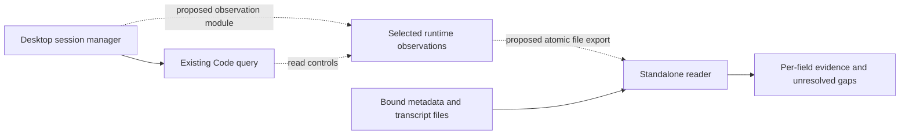

# Automated observations for a Claude Desktop Code receiver

This design proposes a small observer inside Claude Desktop and a selected-file
reader outside it. The observer would reach the existing Code query through
Desktop's session manager and export observations for one consented task. The
standalone reader would combine those observations with the separately bound
delivery and acknowledgment evidence.

The access path is concrete enough for a bounded prototype decision. The full
preservation claim remains unresolved: the inspected interfaces do not yet
establish fresh account identity, current cwd, or a complete applied permission
snapshot. Adopting this design for an experiment would accept an app change and
its maintenance cost; it would not qualify the notification route.

## Contract and evidence boundary

The destination is ChatGPT in Codex mode notifying an exact, existing,
consent-bound Claude Desktop-hosted Code task on the same Linux machine. The
receiver must supply delivery evidence and an explicit acknowledgment carrying
the notification's correlation ID. Before/after observations must cover the
actual account route, model, applied permissions, and worktree. Permissions
include active mode, effective rules and grants, and pending changes, as settled
in [Choose how to obtain the missing receiver observations](https://github.com/nisavid/provingkit/issues/273#issuecomment-5886197304).

**Source-backed** below means traced package code or a published declaration.
**Proposed** means an interface or behavior to implement and review.
**Unresolved** means the required producer or semantics are not established.
Nothing in this design is a live qualification result or an observation of a
private receiver. This work read static application code and public package
declarations. It did not execute application modules, query a running receiver,
read private receiver records or credentials, install anything, or send a message.

The [observation-path report](https://github.com/nisavid/provingkit/blob/ec4f5fa1296682a583d6b6d73a42df201004bd14/docs/superpowers/research/2026-09-29-desktop-observation-paths.md)
owns selected metadata/transcript acquisition and its limits. This design adds
the runtime access path. The [sender report](https://github.com/nisavid/provingkit/blob/ee76e2a85c6cff97bd2111eefdc41fa6dfd433be/docs/superpowers/research/2026-09-26-claude-inbox-feasibility.md)
owns the native MCP sender and discovery findings. Their claims remain separate.

## Source identity

Inspection on 2026-09-29 used `claude-desktop-extra` **2.9939.4-1**, ASAR
manifest `@ant/desktop` **2.9939.4**, archive SHA-256
`4ac2b896dabf3e871f9cf6d9833d02f9f6ad2a839dae6658edc84bb08341238a`.
Paths below are relative to that archive. Minified names locate these bytes;
they are not stable API names.

| Source | SHA-256 | Relevant producers and callers |
| --- | --- | --- |
| `.vite/build/index.chunk-B9SZqsi8.js` | `bd2144a3653bb843f4b75fe652124a4e478f273b5f6c2e10a2139fa3a9a3152f` | Session manager, `spawnSessionQuery`, `liveQueryOf`, `readContextUsage`, `spawnAccountOf`, `formatSessionForEvent`, permission update paths, worktree events |
| `.vite/build/index.chunk-CKt-cwRV.js` | `dad88ac66fe13f72d0225c49d48e124d238ff643ff96426c4a2020482621e62d` | `Gd` host tools, `bb`, `wb.createProxyServers`, permission-state parser `n.br` |
| `.vite/build/index.chunk-COPWZCsC.js` | `b22a9dc34684cef348f9c0e72abe88c433bbfc2d350d9a3e61faf7ae22858950` | `createLocalSessionsApi`, `getSession`, bridge-ID lookup |
| `.vite/build/index.chunk-DuaKZOPP.js` | `f160a24940ee11cea6a788a9038e95c14fb150889977dcfa331fd9b07aba0c96` | LocalSessions binding through `Ob.for(webContents).setImplementation` |
| `.vite/build/mainView.js` | `626d655507c0d483653e5f1eca9d43352616defeb2d94d695b76ead777a209a5` | Renderer IPC invocation |
| `.vite/build/index.chunk-vRLpacfH.js` | `ac8acccdebfdd2a165bb5f4d9710b80540b46ce01207f85eae42696a0c7819e1` | SDK getters, initialization cache, client version `0.3.284` |

The matching published
[`@anthropic-ai/claude-agent-sdk` 0.3.284 package](https://registry.npmjs.org/@anthropic-ai/claude-agent-sdk/0.3.284)
was downloaded as data, with registry SHA-512 integrity verified. Its tarball
SHA-256 is `4550e830246026133fc1802a2208dd0f3a785cae1eec83f261d114c33d797771`;
`sdk.d.ts` SHA-256 is
`048ae2e6c796cc2aa3c423afaad59a08972cb48c271ffcc9847d910ff65f61b2`.
Useful declarations are `AccountInfo`, `SDKControlGetContextUsageResponse`,
`SDKControlGetSettingsRequest`, `SDKControlListPermissionRulesResponse`,
`SDKControlPermissionRulesState`, and `SDKPermissionRuleEntry`. Matching the
version string supports comparing these declarations with the bundled client;
it does not prove the installed receiver implements every response.

The fetched [public TypeScript reference](https://code.claude.com/docs/en/agent-sdk/typescript)
does not describe `getSettings`, `listPermissionRules`, or `getStatus`. The
shipped controls below are dependencies on inspected internals, not a claim of
documented public API stability.

## Existing access paths

| Path | Concrete source chain | Coverage and cost |
| --- | --- | --- |
| Selected metadata and transcript files | Manager serializer and transcript resolver traced in the observation-path report | Works as a standalone acquisition design without an app change. Saved state, delayed persistence, and absent in-memory rows prevent full runtime preservation and negative delivery conclusions. |
| Desktop host `get_session` | `Gd` registers for `sessionType === "ccd"`; `bb` includes it; `wb.createProxyServers` creates SDK MCP servers; `setupMcpAndPlugins` passes them into the Desktop-owned query | An in-process host tool serving Code. No external attach address was established. Its projection is incomplete for this claim. |
| LocalSessions renderer API | `createLocalSessionsApi.getSession` calls the manager; `Ob.for(webContents).setImplementation` binds it; the renderer invokes Electron IPC | Reaches the live manager inside the app. It exposes `harnessCwd` and pending permission cards but omits several applied/pending fields. No standalone reader connection was established. |
| Existing query controls | Manager owns `record.query`; SDK methods send control requests to that query | Most useful acquisition point. It needs a new app-side caller/exporter and response qualification. A new SDK query would observe a different executor. |

Adding another host MCP getter would still leave the standalone access problem.
Extending only LocalSessions would still require a reader inside Desktop's
renderer. Exposing generic query or Electron RPC would add a much broader
interface than the observation needs. The proposed adapter instead makes one
selected observation file available to the reader.

`readContextUsage` rejects missing or unavailable queries. `withTemporaryQuery`
creates a new Code query for configuration work and is unsuitable here. An idle
turn can retain a query; `isRunning` describes turn activity and cannot establish
executor presence. The observer must neither create a query nor wake a parked
task to obtain a snapshot.

## Proposed module and interface

Place an observation module beside the session manager's existing read methods.
Keep Desktop symbols, Code controls, and field projection inside that module.
The external reader consumes a versioned observation envelope and selected
transcript records; it never imports Desktop modules or receives a raw query.

The proposed internal call is `observeReceiver(binding, deadline)`. The binding
selects one Desktop task and its expected Code lineage. It never selects the
newest, first, or similarly named task. An explicitly armed, fixture-scoped
export invokes that call, writes one complete envelope by atomic replacement,
and stops at its agreed expiry or a binding change. Cadence, expiry, file access,
and permitted fields belong in the reviewed experiment plan. This is a new
export path, not an existing endpoint.

Each envelope carries:

- Observation schema and adapter identities; inspected Desktop, SDK, and actual
  executor identities when obtained through the authorized fixture procedure.
- Desktop task ID, Code session ID and relevant lineage, app-start identity,
  observer generation, and a monotonically increasing sample sequence.
- Start/end times for the whole collection and each asynchronous field read;
  the originating getter or event and its last observed time where known.
- Separate results for account, model, permission mode, rules/directories,
  host grants, pending changes, and cwd. A field's value is observed, unavailable,
  or unknown, with evidence and reason attached. Its dependency compatibility
  is recorded separately. An observed cached value remains explicitly cached;
  it is not current by label.
- Explicit coverage gaps and whether the binding changed during collection.
  No overall preservation or delivery success Boolean is produced here.

Capture the session record, query object, input stream, and Code session ID
before reads. Recheck them afterward. Increment an observer generation on
query installation, teardown, or relevant identity replacement; discard a
collection crossing a generation boundary. A restarted exporter uses a new
app-start identity so an old file cannot appear current. These are proposed
race checks. Desktop's existing request wrapper tracks in-flight requests but
does not establish this snapshot contract.

Getters run against the captured query with bounded timeouts. A missing query,
failed request, unknown control subtype, expired sample, or changed binding
leaves the dependent observation unavailable or unknown. No fallback invokes
`withTemporaryQuery`, resumes the task, changes settings, or sends a prompt.
The implementation must specify how late replies are discarded without
interrupting the receiver; a caller-side deadline alone is not cancellation.

Export only fields selected for the experiment. Account route needs non-secret
identifiers/provider information, not tokens. Rules, paths, and grants may
themselves be private fixture data, so their access and retention must be
covered explicitly. Do not serialize the full manager, environment,
initialization payload, settings response, or context-usage response. The
prototype's access controls and data projection need review before installation;
this design does not certify them.

## Field producers and remaining gaps

| Required observation | Source-backed acquisition | Proposed interpretation and unresolved requirement |
| --- | --- | --- |
| Account route | `spawnAccountOf` reads the spawn identity/org associated with the input stream. SDK `accountInfo()` returns cached `initialization.account`; published `AccountInfo` describes provider/source and optional account information. | Export these as initialization/spawn facts with time and origin. A fresh executor-bound authenticated-route producer after refresh is missing. Metadata storage location and unchanged spawn identity cannot fill that gap. |
| Model | `getContextUsage({detail: "summary"})` returns a declared `model`. Desktop's `readRunningModel` uses it in a gated SSH reattachment path; `readContextUsage` reaches the existing query. | Query and project the model with its interval. Establish local receiver support and what freshness the response has. Summary usage uses last-response data and local estimates; the source does not prove that its model field always equals the next effective model. `modelConfirmed` and a saved alias alone are insufficient. |
| Active permission mode | Desktop awaits `setPermissionMode`, then updates its manager value. Code `system/init` and `system/status` events can also update it. | Report last Code event, pending setter state, and any conflicting manager selection separately. A fresh Code mode getter is not established. SDK `getStatus()` exists, but its response shape and relevant caller are unestablished; do not assume it supplies mode. |
| Rules and workspace grants | `listPermissionRules()` sends `list_permission_rules`. Published types describe live rules and workspace directories, including rule source, behavior, editability, managed-only handling, and parse errors. Desktop's existing caller reads only `managedOnly`. | Project the structured state, preserving inactive-rule markers and errors. Qualify actual executor support and completeness. Skipped settings files and their errors cannot be silently treated as a complete intended configuration. `originalCwd` in this response is not current cwd. |
| Host grants and pending changes | App paths use `alwaysAllowedReasons`, computer-use grant state, `sessionPermissionUpdates`, flag-scope synchronization, and mode requests in flight. `addDirectories` can record an update before a flag push succeeds. | Inventory the applicable app-side grant stores and mutation paths; export their observed values/pending operations separately from Code rules. A complete combined applied configuration and its timing are not yet proven. Pending tool-permission cards alone omit these facets. |
| Runtime worktree/cwd | `harnessCwd` is held in the manager and updated from Code initialization and worktree events. LocalSessions formats it for the renderer. | Export the last manager-observed cwd with its event provenance. A fresh arbitrary executor-cwd getter is missing. Do not infer such a field in `getStatus()` or substitute the saved worktree path. |

This observation contract concerns configuration actually applied to the
receiver. It does not prove enforcement for every possible action. The
permission inventory must account for Code state and host-side grants used by
Desktop, and expose every unobserved applicable facet. A successful rules call
cannot mark the entire permission observation complete.

The getters are asynchronous and do not provide a transactional snapshot.
Per-field intervals, pending operations, and observed changes must accompany
comparisons. Stable identity and equal endpoint values can support a bounded
before/after result once qualified; they do not prove there was no transient
change between samples. Any stronger interval-wide preservation claim needs a
complete change stream or another justified observation contract.

## Identity, delivery, and outcome evidence

Desktop task ID, Code init session ID, query generation, and transcript lineage
form part of the binding. A stored `cliPid` can contribute to a later fixture
comparison, but a PID alone is reusable and does not prove current process
identity. The fixture plan must establish a process-start identity and actual
executor build through an authorized observation. Native discovery address to
this task/process remains a separate unresolved link. `bridgeSessionId` belongs
to Remote Control; it is not established as the native inbox address.

Desktop is aware of native `SendMessage`: its host tool guidance points at
native local peer IDs, and its tool hooks inspect that operation. This supports
an integration relationship, but does not establish that the external native
sender enters `trackPeerInbound` or emits Desktop host receipt records.

The observer therefore does not manufacture delivery or acknowledgment. The
standalone reader must recognize the selected external sender's actual
receiver-origin record, with the established origin, exact peer, and correlation
ID. It must then recognize a distinct receiver acknowledgment under the
interface's grammar. Quoted text, echoes, pair-level reply flags, sender success,
and a runtime-state snapshot do not supply that evidence.

`submit` returns the correlation ID and known state; bounded `wait`/`inspect`
collects newer evidence without resending. Positive, correctly bound receiver
evidence may reconcile an uncertain submission. A quiet file, stale envelope,
timeout, or absent record leaves the result unknown. Held and refused require
explicit evidence from the selected route's producer; synthetic coverage remains
the initial failure plan. Missing state must not be invented from delay.

## Cost and compatibility

The adapter would require a maintained change to the Desktop build or a
reviewed instrumentation mechanism. It is not an ordinary Rolecasting skill
installation. Exact insertion/build tooling, rollout, rollback, and whether the
chosen mechanism requires restarting Desktop must be established before
installation. A modified Desktop candidate also changes the subject of initial
qualification; success would apply to that candidate, not silently to stock
Desktop. Restarting or instrumenting a running task may affect it, which is why
the proposed first fixture is disposable.

Maintenance covers manager lifecycle hooks, SDK control contracts, field
projection, and selected-file export. The reader can keep a small stable
envelope interface while the adapter absorbs changes to minified application
internals. Control requests add work to the receiver process; summary context
usage avoids the documented full-detail token-count requests, but its latency
and other effects still need observation. Polling frequency must be measured
and bounded in the fixture plan.

Apply the [graduated compatibility policy](https://github.com/nisavid/provingkit/issues/271#issuecomment-5884146675):
a new build is unassessed, not incompatible. Carry forward findings when the
consumed behavior is justified unchanged. Start with relevant release notes,
artifact comparison, and contract fixtures; inspect changed producers and
repeat affected live checks only where those cheaper checks leave uncertainty.
An unrelated archive change does not invalidate every observation. Release-note
silence does not prove an internal contract unchanged.

Track compatibility separately for query lifecycle/binding, each getter and
field projection, permission-store inventory, envelope export, and external
message representation. A demonstrated failed assumption disables the affected
function and conclusions that depend on it. Missing evidence in a particular
message remains unknown even with a compatible adapter. No compatibility
assessment supplies the route's still-missing initial live qualification.

## Smallest experiments and checks

I recommend a decision on a **source-and-synthetic observer prototype**, followed
by a separately reviewed proposal for an early **no-send disposable probe**.
The source prototype should implement the narrow module against fake
manager/query inputs, with a concrete patch or instrumentation plan for the
inspected Desktop candidate. It should demonstrate the export boundary and
return explicit gaps rather than inventing the missing fields. This would make
the app-change cost reviewable before any installation.

Meaningful synthetic checks cross that same interface:

- Correct task with existing idle/busy query; absent or replaced query; Code
  lineage change during a delayed getter; exporter restart and expired files.
- Unknown control subtype, malformed response, partial fields, parse errors,
  stale events, and a deadline followed by a late reply. No fixture may hide a
  wake, prompt, setter, temporary query, or resend behind observation.
- A saved mode differing from a Code event, queued/failed flag updates,
  ignored rules, and a host grant change while Code rules stay equal.
- Atomic file replacement, truncated/old envelopes, and reader agreement with
  the per-field evidence/coverage model. Projection excludes raw responses.

The earlier live probe is a proposal, with these concrete boundaries:

| Element | Proposed scope |
| --- | --- |
| Candidate | Independently reviewed observer/reader bytes and exact Desktop modification; source checks and synthetic results retained. |
| Fixture and authority | One disposable Desktop Code task, selected explicitly. Separately authorize the app change, installation/restart effects, task creation, and the exact fixture data to read. Review rollback and app restoration. |
| Reads | Existing-query getters for settings, permission rules, summary context, and, if separately reviewed, `getStatus`; selected manager fields. Retain only approved response field names/types and non-secret fixture values. No raw account/settings/environment dump. |
| Questions | Does the actual executor implement each getter? Which fields and times does it report? Can native discovery, Desktop task, Code lineage, and process identity be bound? Does any observed field close current account/mode/cwd gaps? What latency or receiver effects do the reads cause? |
| No-send boundary | No notification or action-request message. Initial fixture setup prompts, if needed to establish a running query, belong explicitly in its authorization. This probe cannot establish external delivery or acknowledgment. |
| Return | A report of supported fields, timing, gaps, and effects. If full preservation still lacks a producer, return for a decision about a further producer change, claim revision, or hold. Do not loop through general research. |

Observing a sample `getStatus` response would reveal its schema, not prove its
fields' freshness or completeness. Controlled account/model/mode/grant/cwd
transitions would need an explicitly reviewed fixture plan; do not change
permissions to make a test pass. Any Code-side addition for missing fields is
another candidate and adoption decision, not authority supplied by this design.

After these prerequisites are settled, the existing source review and live
gates still apply. Exact-peer send consent precedes idle/busy notification
proof; that proof must establish the external receiver record, correlated ACK,
timing, and before/after preservation. Busy context continuity remains diagnostic.
The reverse Queue/Steer experiments remain in their separate map.

## Decision and procedure consumers

The next decision is whether to accept the app-change dependency for this
bounded prototype/probe route, revise the evidence claim, or hold pending a
usable existing interface. My recommendation is the bounded route above,
with implementation and live access separated. A complete automated observer
has not yet been established; keep the interface blocked while the required
producer facts and adoption decisions remain open.

Use `capturing-agent-procedures` to connect the reviewed design to:

- [Specify the notification interface and qualification evidence](https://github.com/nisavid/provingkit/issues/214): distinguish cached, current, partial, and unknown observations; define bounded collection and ACK grammar only after the unresolved observer prerequisites are settled.
- [Implement the exact-peer notification actuator](https://github.com/nisavid/provingkit/issues/215): keep reader, observer adapter, and sender testable separately; invoke only the adopted observation contract and retain the behavior-specific compatibility inventory.
- [Capture the Rolecasting peer-notification skill and invocation](https://github.com/nisavid/provingkit/issues/216): own the focused procedure's maintained source, invocation, compatibility assessment, and recovery guidance. Record the reviewed design/source revision consumed; do not install this unsettled proposal as a standing method.
- [Prepare the disposable receiver and preservation observation plan](https://github.com/nisavid/provingkit/issues/218): bind every read, setting observation, lifecycle effect, and eventual send to the authorized fixture and candidate. If an earlier probe is adopted, chart its own review and authorization gates before this downstream qualification plan runs.

The source-only inspection procedure remains in the retained receiver-evidence
report referenced by the observation-path report. Future inspection should
follow callable producers and consumers, record their exact bytes, and separate
declarations from observed execution. This design adds a proposed acquisition
method; it changes no installed procedure or plugin. Closing the design task
requires a native decision blocker to retain its unresolved adoption and source
requirements, with the four consumers linked to this published revision.
